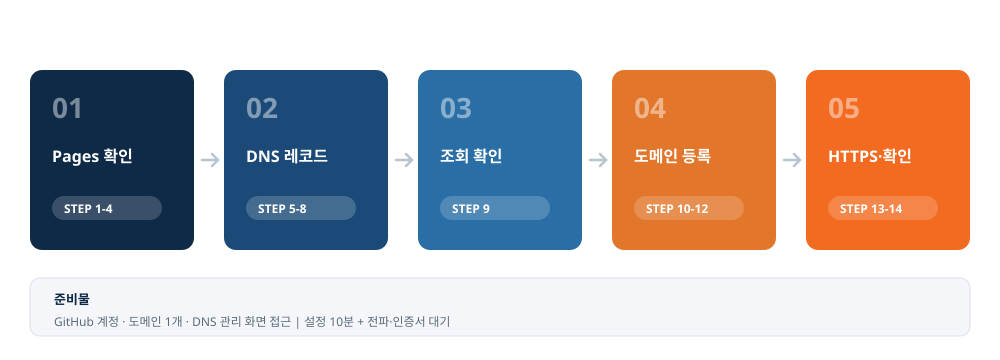
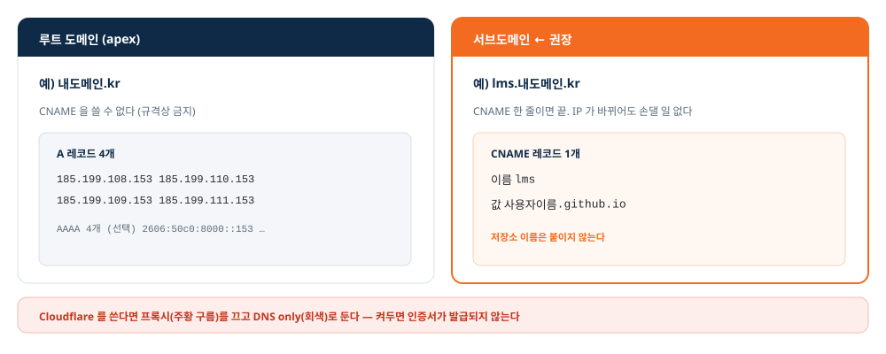
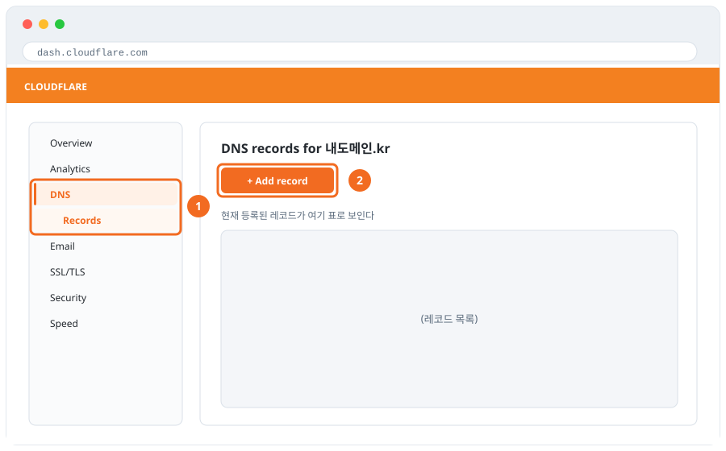
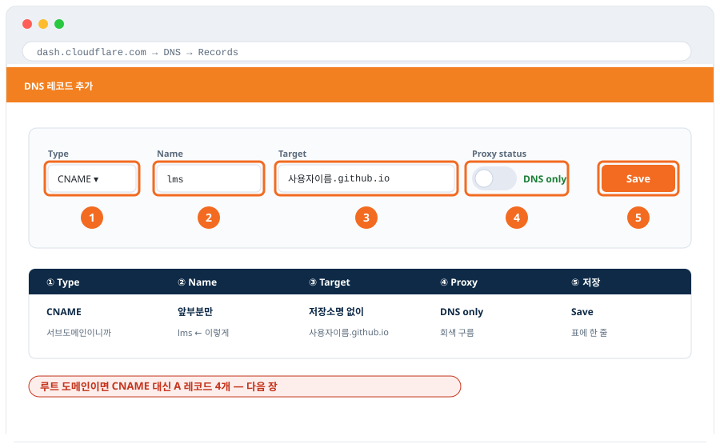
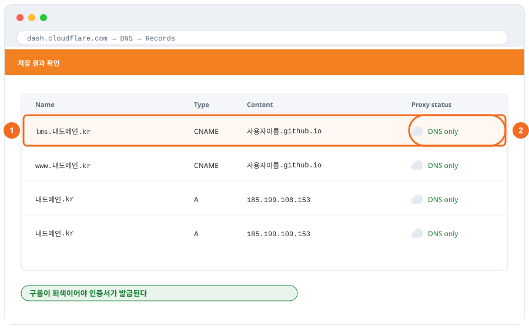
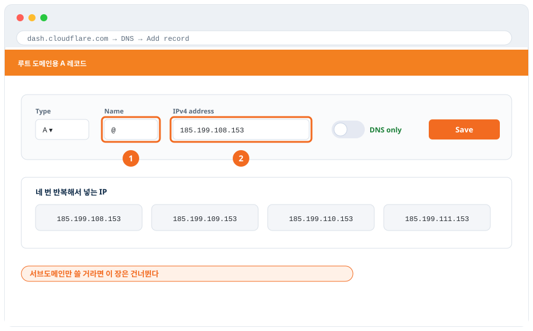
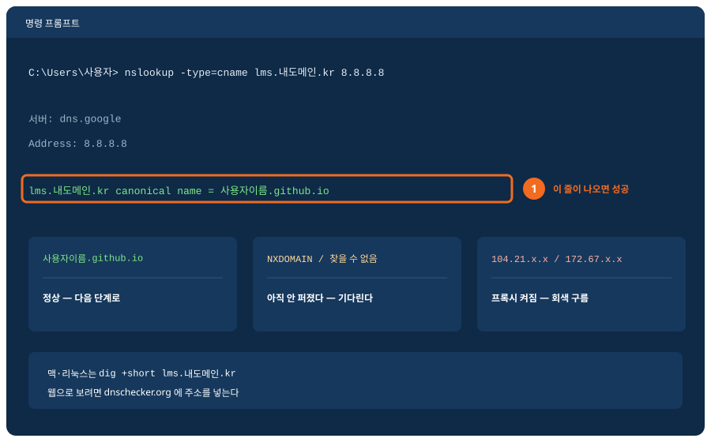
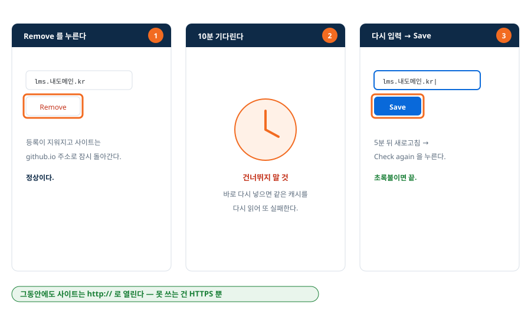
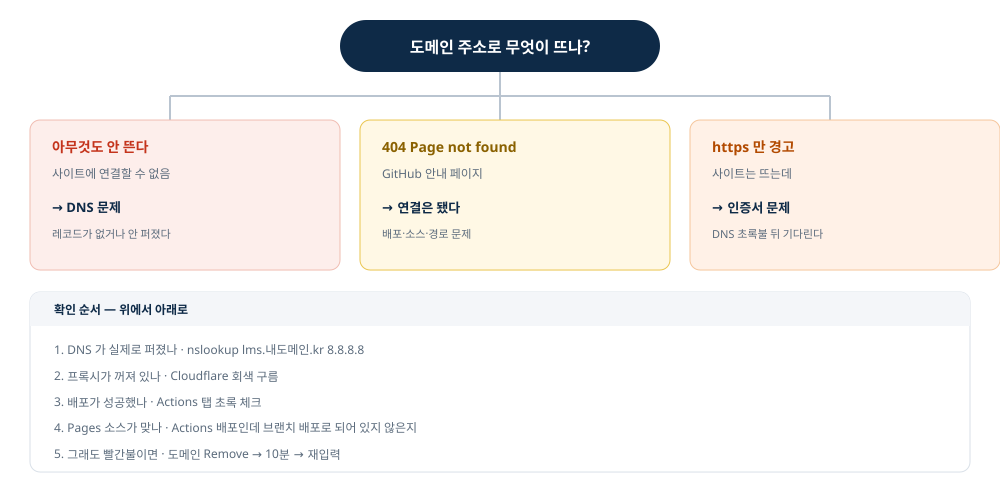
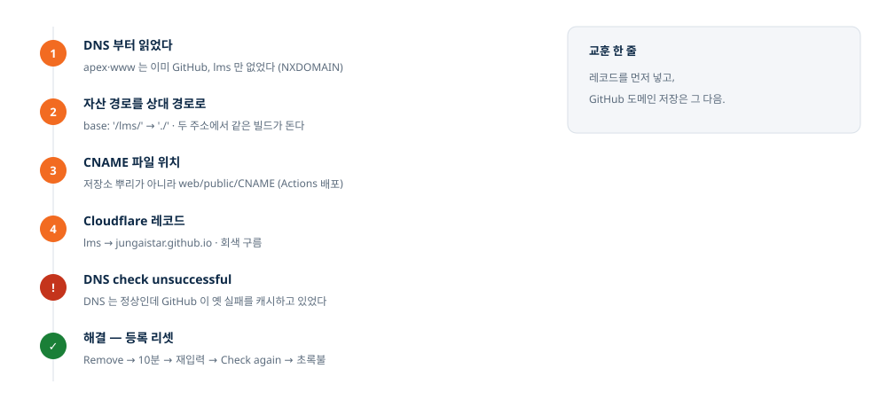

# GitHub Pages 사이트에 내 도메인 연결하기

**화면 따라 하기 가이드** · 14단계 · v1.0 (2026-08-20)

| 항목 | 내용 |
|---|---|
| 대상 | GitHub Pages 로 사이트를 이미 올려 본 사람 |
| 결과 | `사용자이름.github.io/저장소/` → **`lms.내도메인.kr`** |
| 준비물 | GitHub 계정 · 도메인 1개 · DNS 관리 화면 접근 |
| 시간 | 설정 약 10분 + 전파·인증서 대기 |

> 화면 그림은 모두 **편집 가능한 SVG**(`shots/`)입니다. `사용자이름` · `내도메인.kr` 을
> 우리 값으로 바꾸면 그대로 기관 교안이 됩니다.

---

## 한눈에 보기 — 전체 흐름



**DNS 레코드를 먼저 넣고, GitHub 등록은 그 다음입니다.** 순서만 지켜도 대부분의 오류가 생기지 않습니다.

---

## 준비 지식 — 어떤 레코드를 넣나



| 쓰려는 주소 | 레코드 | 값 | 개수 |
|---|---|---|---|
| `lms.내도메인.kr` (서브도메인, **권장**) | CNAME | `사용자이름.github.io` | 1개 |
| `내도메인.kr` (루트 도메인) | A | `185.199.108~111.153` | 4개 (+AAAA 4개) |

---

## STEP 1 — 저장소 설정으로 들어간다


**이 단계의 목표** — 도메인 설정이 있는 화면까지 들어갑니다.

1. 브라우저에서 github.com 에 로그인하고 내 저장소를 엽니다.
2. 상단 탭 줄의 맨 오른쪽 Settings 를 누릅니다.
3. 주소가 .../저장소/settings 로 바뀌면 성공입니다.

> **안 보이나요?** — Settings 탭은 저장소 주인에게만 보입니다. 내 계정의 저장소가 맞는지 확인하세요.

---

## STEP 2 — 왼쪽 메뉴에서 Pages 를 찾는다


**이 단계의 목표** — GitHub Pages 설정 화면을 엽니다.

1. 왼쪽 세로 메뉴를 아래로 내립니다.
2. Code, planning, and automation 묶음의 Pages 를 누릅니다.
3. 오른쪽에 GitHub Pages 제목이 나오면 성공입니다.

> **위치** — 메뉴가 깁니다. Codespaces 바로 아래에 있습니다. 화면이 좁으면 메뉴가 접혀 있을 수 있습니다.

---

## STEP 3 — 배포 방식(Source)을 고른다


**이 단계의 목표** — 내 프로젝트에 맞는 배포 방식을 정합니다.

1. Build and deployment 의 Source 드롭다운을 누릅니다.
2. HTML 을 그대로 올렸다면 Deploy from a branch 를 고릅니다.
3. React·Vue 처럼 빌드가 필요하면 GitHub Actions 를 고릅니다.

> **가장 흔한 실수** — 빌드가 필요한 프로젝트인데 Deploy from a branch 로 두면 저장소 루트가 그대로 서비스되어 README 가 렌더된 페이지가 뜹니다.

---

## STEP 3+ — 배포가 성공했는지 확인한다


**이 단계의 목표** — 새 내용이 실제로 올라갔는지 봅니다.

1. 저장소 상단의 Actions 탭을 누릅니다.
2. 맨 위 실행에 초록 체크(✓)가 있는지 봅니다.
3. 빨간 ✕ 면 눌러서 실패 로그를 확인합니다.

> **왜 먼저 보나** — 배포가 실패한 채로 도메인을 붙이면 옛 화면이나 404 가 뜹니다. 원인을 도메인에서 찾다 시간을 버립니다.

---

## STEP 4 — 기본 주소부터 열어 본다


**이 단계의 목표** — 도메인을 붙이기 전에 사이트가 살아 있는지 확인합니다.

1. Pages 화면 맨 위 Your site is live at 의 주소를 확인합니다.
2. Visit site 를 눌러 실제로 열어 봅니다.
3. 내 사이트 화면이 뜨면 다음 단계로 갑니다.

> **여기가 기준선** — 기본 주소가 안 열리면 도메인을 붙여도 안 열립니다. 404 가 뜨면 STEP 3 · STEP 3+ 로 돌아갑니다.

---

## STEP 5 — DNS 관리 화면을 연다



**이 단계의 목표** — 도메인의 레코드를 추가할 수 있는 화면으로 갑니다.

1. 도메인을 관리하는 곳(Cloudflare·가비아·후이즈)에 로그인합니다.
2. 내 도메인을 고르고 왼쪽 메뉴에서 DNS → Records 로 들어갑니다.
3. + Add record 를 눌러 입력 칸을 펼칩니다.

> **다른 업체라면** — 가비아·후이즈는 "DNS 관리 → 레코드 수정" 자리입니다. 채우는 칸(종류·이름·값)은 어디나 같습니다.

---

## STEP 6 — 레코드 한 줄을 채운다



**이 단계의 목표** — 서브도메인이 GitHub 을 가리키게 합니다.

1. Type 을 CNAME 으로 고릅니다.
2. Name 에 앞부분만 적습니다 (예: lms). 뒤 도메인은 자동으로 붙습니다.
3. Target 에 사용자이름.github.io 를 적습니다. 저장소 이름은 붙이지 않습니다.
4. Proxy status 를 DNS only(회색 구름)로 둡니다.
5. Save 를 누릅니다.

> **주황 구름 금지** — 프록시를 켜면 GitHub 이 도메인 소유를 확인하지 못해 HTTPS 인증서가 발급되지 않습니다.

> **붙여넣기보다 타이핑** — 복사한 값에 보이지 않는 공백이 섞이면 GitHub 이 읽지 못합니다.

---

## STEP 7 — 저장된 레코드를 눈으로 확인한다



**이 단계의 목표** — 값이 제대로 들어갔는지 표에서 확인합니다.

1. DNS → Records 표에서 내가 만든 줄을 찾습니다.
2. Name · Type · Content 세 값이 맞는지 봅니다.
3. Proxy status 가 회색 구름(DNS only)인지 봅니다.

> **주황이면** — 구름을 눌러 회색으로 바꾸고 저장합니다. 몇 분 뒤 반영됩니다.

---

## STEP 8 — 루트 도메인이면 A 레코드 4줄



**이 단계의 목표** — 앞에 아무것도 없는 도메인(내도메인.kr)을 연결합니다.

1. Type 을 A 로, Name 을 @ 로 둡니다.
2. IPv4 주소 칸에 IP 를 하나 넣고 저장합니다.
3. 남은 IP 세 개도 같은 방법으로 넣습니다 (모두 DNS only).

```
185.199.108.153
185.199.109.153
185.199.110.153
185.199.111.153
```

> **서브도메인만 쓴다면** — 이 단계는 건너뜁니다. 루트 도메인은 규격상 CNAME 을 쓸 수 없어 IP 를 직접 적습니다.

---

## STEP 9 — 퍼졌는지 내 컴퓨터에서 확인한다



**이 단계의 목표** — 화면 글씨가 아니라 실제 DNS 상태를 봅니다.

1. 시작 버튼을 누르고 cmd 를 입력해 명령 프롬프트를 엽니다.
2. 아래 명령을 한 줄 칩니다.
3. 결과에 사용자이름.github.io 가 나오면 성공입니다.

```
nslookup -type=cname lms.내도메인.kr 8.8.8.8
```

> **맥·리눅스** — dig +short lms.내도메인.kr 을 씁니다. 웹으로 보려면 dnschecker.org 에 주소를 넣습니다.

---

## STEP 10 — GitHub 에 도메인을 등록한다


**이 단계의 목표** — GitHub 이 이 주소로 사이트를 서비스하게 합니다.

1. Settings → Pages 의 Custom domain 칸에 주소를 직접 타이핑합니다.
2. Save 를 누릅니다.
3. 잠시 뒤 DNS check successful 초록 문구를 확인합니다.

> **Actions 로 배포한다면** — Save 를 누르면 GitHub 이 저장소에 CNAME 파일을 만들지만 그 파일은 쓰이지 않습니다. 빌드 결과물 안에 CNAME 이 들어가야 합니다 (Vite 는 public/CNAME).

---

## STEP 11 — 빨간 글씨가 떴다면


**이 단계의 목표** — 오류의 원인을 셋 중 하나로 가릅니다.

1. DNS check unsuccessful 아래 오류 문구를 읽습니다.
2. STEP 9 의 조회로 진짜 DNS 상태를 확인합니다.
3. 원인에 맞는 처방을 고릅니다 (기다림 · 회색 구름 · 리셋).

> **InvalidDNSError** — "DNS 레코드를 가져올 수 없다"는 뜻입니다. 조회는 정상인데 여기만 빨간불이면 GitHub 이 옛 실패를 캐시한 것입니다.

---

## STEP 12 — 등록을 리셋한다



**이 단계의 목표** — GitHub 이 DNS 를 새로 조회하게 만듭니다.

1. Custom domain 옆 Remove 를 누릅니다.
2. 10분 기다립니다. 이 대기를 건너뛰면 같은 캐시를 다시 읽습니다.
3. 도메인을 다시 타이핑하고 Save → 5분 뒤 Check again 을 누릅니다.

> **그래도 안 되면** — ① CNAME 대신 A 레코드 4개 + AAAA 4개 ② 계정 설정에서 도메인 소유 확인(Verify domain) ③ 최대 24시간까지 기다립니다.

---

## STEP 13 — 초록불 확인 → HTTPS 를 켠다


**이 단계의 목표** — 주소창에 자물쇠가 뜨게 합니다.

1. DNS check successful 초록 문구를 확인합니다.
2. 인증서가 발급될 때까지 5~15분 기다립니다.
3. Enforce HTTPS 체크박스가 켜지면 체크합니다.

> **성급하게 켜지 말 것** — 인증서가 없는 상태에서 강제하면 사이트가 아예 열리지 않습니다. 체크박스가 활성화된 뒤에 켭니다.

---

## STEP 14 — 브라우저에서 최종 확인


**이 단계의 목표** — 학습자 눈으로 세 가지를 확인합니다.

1. 주소창에 https://내도메인 을 넣고 엽니다.
2. 자물쇠 아이콘과 화면 내용을 확인합니다.
3. 하위 주소로 이동해 F5 를 눌러도 404 가 안 나는지 봅니다.

> **404 가 뜬다면** — 도메인이 아니라 배포 문제입니다. STEP 3 의 Source 와 STEP 3+ 의 배포 성공 여부를 다시 봅니다.

---

## 시작 전 · 끝난 뒤 체크리스트

### 시작 전 (STEP 1~4)

- [ ] **기본 주소가 열린다** — 사용자이름.github.io/저장소/ 로 사이트가 뜬다
- [ ] **배포가 성공했다** — Actions 탭 맨 위에 초록 체크
- [ ] **도메인 관리 화면에 들어갈 수 있다** — 레코드를 직접 추가·삭제할 수 있는 계정
- [ ] **쓸 주소를 정했다** — 예: lms.내도메인.kr

### 끝난 뒤 (STEP 9~14)

- [ ] **레코드가 조회된다** — nslookup 결과가 사용자이름.github.io
- [ ] **DNS check successful** — Pages 화면에 초록 문구
- [ ] **자물쇠가 보인다** — Enforce HTTPS 체크 완료
- [ ] **새로고침해도 404 가 없다** — 하위 주소에서 F5

---

## 자주 생기는 문제

| 증상 | 원인 | 해결 |
|---|---|---|
| **404 Page not found** | 배포 실패 · Pages 소스가 틀림 | Actions 탭 초록 체크 확인 → Source 를 빌드 방식에 맞게 |
| **화면이 하얗다 · CSS 깨짐** | 자산 경로가 /저장소/ 로 박힘 | vite base 를 './' 로 바꾸고 다시 배포 |
| **DNS check unsuccessful** | 레코드 미반영 · 프록시 · GitHub 캐시 | nslookup 으로 원인 확인 → Remove·10분·재입력 |
| **not eligible for HTTPS** | DNS 초록불 전 · 인증서 발급 대기 | 초록불 먼저, 그 뒤 5~15분 기다린다 |
| **리다이렉트 무한 반복** | Cloudflare SSL 모드가 Flexible | SSL/TLS 를 Full (strict) 로 변경 |
| **메일이 스팸으로 간다** | _dmarc · _domainkey 에 프록시가 켜짐 | 두 레코드를 DNS only 로 변경 |



---

## 실전 사례 — lms.miraejob.co.kr



| 단계 | 무슨 일이 있었나 | 교안의 어디 |
|---|---|---|
| DNS 부터 조회 | apex·www 는 이미 GitHub, `lms` 만 없었다(NXDOMAIN) | STEP 9 |
| 자산 경로 수정 | `base: '/lms/'` → `'./'` | 아래 "자산 경로" |
| CNAME 파일 위치 | 저장소 뿌리가 아니라 `web/public/CNAME` | STEP 10 |
| Pages Source | `Deploy from a branch` 로 바뀌어 있었다 | STEP 3 |
| DNS check 실패 | 도메인을 먼저 저장하고 레코드를 나중에 넣었다 | STEP 11 · 12 |
| 곁다리 발견 | `_dmarc`·`_domainkey` 프록시로 메일 인증 깨짐 | 문제 표 |

### 여기서 뽑은 규칙 다섯

1. **레코드 먼저, GitHub 도메인 저장은 나중**
2. **문서보다 조회를 믿는다** — `nslookup` 한 줄
3. **빌드형은 상대 경로** — 전환 중에도 양쪽이 살아 있다
4. **CNAME 파일은 배포물 안에** — 저장소 뿌리가 아니다 (Actions 배포)
5. **회색 구름** — Cloudflare 를 쓰면 이것 하나로 절반이 갈린다

### 빌드형 프로젝트의 자산 경로

| 설정 | github.io/저장소/ | 내도메인/ |
|---|---|---|
| `base: '/저장소이름/'` | 정상 | 화면이 하얗게 뜬다 |
| `base: '/'` | 깨진다 | 정상 |
| **`base: './'` (상대 경로)** | 정상 | 정상 |

```js
// vite.config.ts
export default defineConfig({
  base: './',     // 두 주소 모두에서 동작 — 전환 중에도 사이트가 죽지 않는다
});
```

---

## 부록 A. 한 장 요약

```
STEP 1~2    저장소 → Settings → Pages
STEP 3      Source 고르기 (빌드형이면 GitHub Actions)
STEP 3+     Actions 탭에서 초록 체크 확인
STEP 4      github.io 기본 주소가 열리는지 확인
STEP 5~7    DNS → Add record → CNAME · lms · 사용자이름.github.io · 회색 구름
STEP 8      (루트 도메인이면) A 레코드 4개
STEP 9      nslookup 으로 퍼졌는지 확인
STEP 10     GitHub → Pages → Custom domain 입력 → Save
STEP 11~12  빨간불이면 원인 3가지 확인 → Remove·10분·재입력
STEP 13     초록불 뒤 Enforce HTTPS 체크
STEP 14     브라우저에서 자물쇠·화면·새로고침 확인
```

## 부록 B. 명령어

```bash
nslookup -type=cname lms.내도메인.kr 8.8.8.8   # 서브도메인 (Windows)
nslookup 내도메인.kr 8.8.8.8                    # 루트 도메인 (Windows)
dig +short lms.내도메인.kr                      # macOS · Linux
```

## 부록 C. GitHub Pages 주소

| 종류 | 값 |
|---|---|
| A (IPv4) | `185.199.108.153` · `185.199.109.153` · `185.199.110.153` · `185.199.111.153` |
| AAAA (IPv6) | `2606:50c0:8000::153` · `8001::153` · `8002::153` · `8003::153` |

## 부록 D. 화면 파일

| 파일 | 장면 |
|---|---|
| `shots/shot-01.svg` | STEP 1 저장소 설정으로 들어간다 |
| `shots/shot-02.svg` | STEP 2 왼쪽 메뉴에서 Pages 를 찾는다 |
| `shots/shot-03.svg` | STEP 3 배포 방식(Source)을 고른다 |
| `shots/shot-04.svg` | STEP 3+ 배포가 성공했는지 확인한다 |
| `shots/shot-05.svg` | STEP 4 기본 주소부터 열어 본다 |
| `shots/shot-06.svg` | STEP 5 DNS 관리 화면을 연다 |
| `shots/shot-07.svg` | STEP 6 레코드 한 줄을 채운다 |
| `shots/shot-08.svg` | STEP 7 저장된 레코드를 눈으로 확인한다 |
| `shots/shot-09.svg` | STEP 8 루트 도메인이면 A 레코드 4줄 |
| `shots/shot-10.svg` | STEP 9 퍼졌는지 내 컴퓨터에서 확인한다 |
| `shots/shot-11.svg` | STEP 10 GitHub 에 도메인을 등록한다 |
| `shots/shot-12.svg` | STEP 11 빨간 글씨가 떴다면 |
| `shots/shot-13.svg` | STEP 12 등록을 리셋한다 |
| `shots/shot-14.svg` | STEP 13 초록불 확인 → HTTPS 를 켠다 |
| `shots/shot-15.svg` | STEP 14 브라우저에서 최종 확인 |
| `shots/flow.svg` · `records.svg` · `diagnose.svg` · `case.svg` | 흐름 · 레코드 종류 · 진단 · 사례 |

---

*실제 구축 사례(2026-08-20, `lms.miraejob.co.kr`)를 바탕으로 만들었습니다.*
