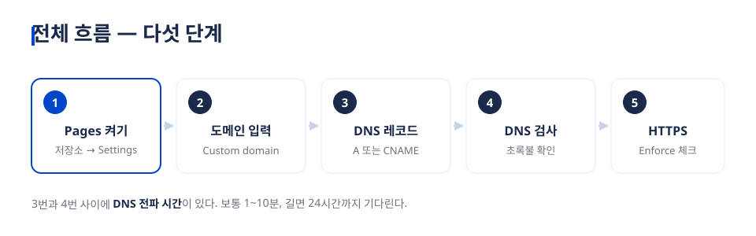
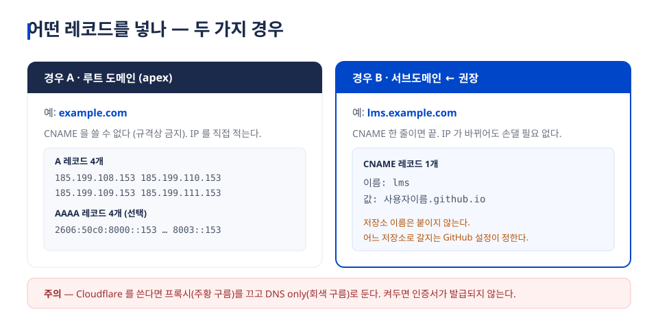
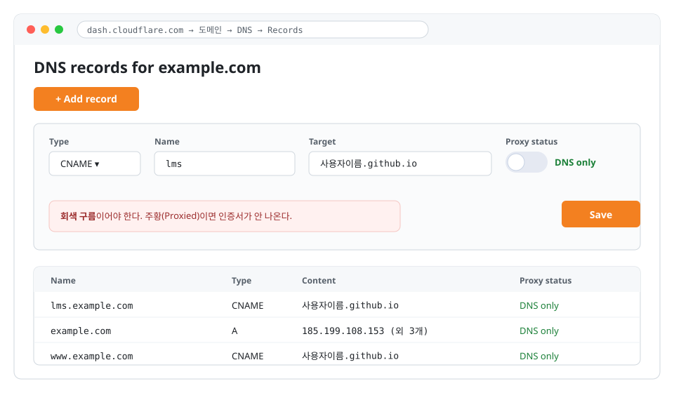
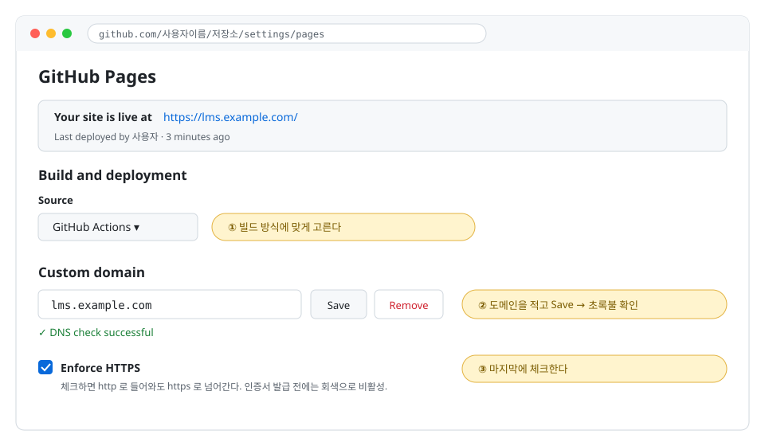
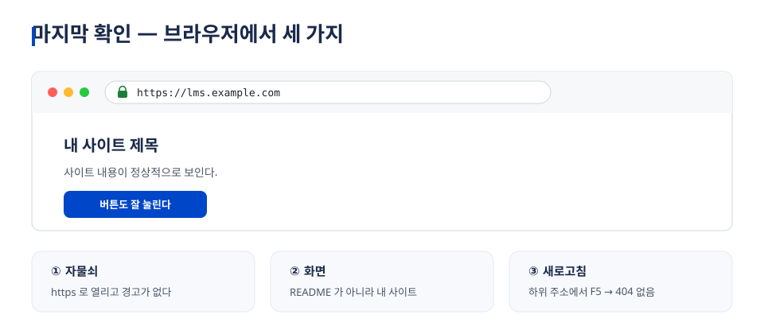
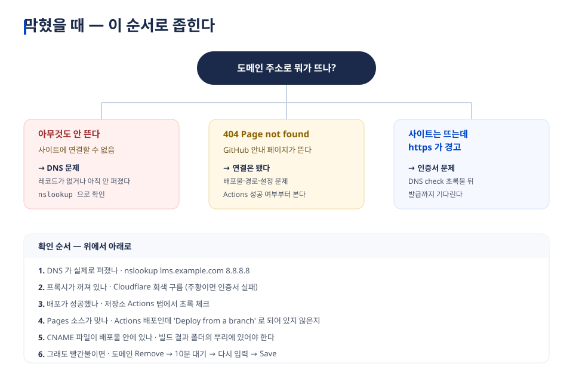

# GitHub Pages 사이트에 내 도메인 연결하기

**실습 중심 강의 교안** · 90분 과정

| 항목 | 내용 |
|---|---|
| 대상 | 정적 사이트를 GitHub Pages 에 올려 본 적이 있는 학습자 |
| 목표 | 강의가 끝나면 `내이름.github.io/저장소` 대신 **내 도메인**으로 사이트가 열린다 |
| 준비물 | GitHub 계정 · 도메인 1개 · DNS 관리 화면 접근 권한 |
| 결과물 | HTTPS 로 열리는 개인 도메인 사이트 |

> 이 교안은 실제로 `lms.miraejob.co.kr` 을 붙이면서 겪은 과정을 그대로 담았습니다.
> 6장 실전 사례에 그때 만난 오류와 해결이 시간순으로 정리되어 있습니다.

---

## 1. 개요

### 1.1 GitHub Pages 란 무엇인가


GitHub 저장소에 올린 **정적 파일**(HTML·CSS·JS)을 그대로 웹사이트로 서비스해 주는 무료 호스팅입니다.

| | 할 수 있는 것 | 할 수 없는 것 |
|---|---|---|
| 파일 | HTML · CSS · JS · 이미지 | 서버 프로그램 (PHP · Node 실행) |
| 데이터 | 외부 API 호출 | 자체 데이터베이스 |
| 주소 | 무료 주소 + 개인 도메인 | — |
| 인증서 | Let's Encrypt 자동 발급 | 사설 인증서 업로드 |

**주소가 두 종류**라는 점이 중요합니다. 이 차이가 뒤에서 오류의 원인이 됩니다.

| 종류 | 저장소 이름 | 기본 주소 | 사이트가 놓이는 위치 |
|---|---|---|---|
| 사용자 사이트 | `사용자이름.github.io` | `https://사용자이름.github.io/` | 뿌리(`/`) |
| **프로젝트 사이트** | 아무 이름 (예: `lms`) | `https://사용자이름.github.io/lms/` | 하위 경로(`/lms/`) |

### 1.2 왜 개인 도메인을 연결하나

1. **기억하기 쉽다** — `jungaistar.github.io/lms/` 보다 `lms.miraejob.co.kr` 이 짧다
2. **신뢰를 준다** — 학생·고객에게 안내할 주소가 기관 도메인이면 설명이 필요 없다
3. **주소를 잃지 않는다** — 나중에 호스팅을 옮겨도 도메인은 그대로 쓴다. GitHub 주소를 배포해 두면 이사할 때 전부 다시 알려야 한다
4. **저장소마다 하나씩 줄 수 있다** — `lms.내도메인`, `blog.내도메인`, `docs.내도메인` 처럼 규칙을 정해 두면 관리가 쉽다

### 1.3 알아야 할 용어 다섯 개

| 용어 | 뜻 | 비유 |
|---|---|---|
| **DNS** | 도메인 이름을 IP 주소로 바꿔 주는 전화번호부 | 114 안내 |
| **A 레코드** | 이름 → IPv4 주소 (예: `185.199.108.153`) | 이름 → 집 주소 |
| **AAAA 레코드** | 이름 → IPv6 주소 | 이름 → 새 형식 주소 |
| **CNAME 레코드** | 이름 → **다른 이름** (별명) | "그 사람 연락처는 옆집과 같아요" |
| **TTL · 전파** | 바꾼 값이 퍼지는 데 걸리는 시간 | 새 전화번호가 전국 안내에 반영되는 시간 |

---

## 2. 준비 단계

### 2.1 저장소 만들기와 Pages 켜기

**① 저장소 준비**

- 이미 사이트 파일이 있다면 그 저장소를 씁니다
- 처음이라면: `Repositories → New` → 이름 입력 → **Public** → Create
- `index.html` 을 하나 올려 둡니다 (내용은 `<h1>안녕하세요</h1>` 한 줄이면 충분)

**② Pages 활성화**

`저장소 → Settings → Pages → Build and deployment → Source` 에서 **둘 중 하나**를 고릅니다.

| 방식 | 언제 쓰나 | 배포되는 것 |
|---|---|---|
| **Deploy from a branch** | HTML 파일을 그대로 올려 둔 경우 | 고른 브랜치의 폴더 그대로 |
| **GitHub Actions** | React·Vue 처럼 **빌드가 필요한** 경우 | 워크플로가 만든 결과물 (예: `dist/`) |

> **여기서 자주 틀립니다.** 빌드가 필요한 프로젝트인데 `Deploy from a branch` 로 두면
> 저장소 루트가 그대로 서비스되어 **README 가 렌더된 페이지**가 뜹니다.

**③ 기본 주소로 먼저 확인**

`https://사용자이름.github.io/저장소이름/` 이 뜨는 것을 **반드시 먼저 확인**하고 다음으로 갑니다.
여기가 안 되면 도메인을 붙여도 안 됩니다.

### 2.2 도메인 준비

| 단계 | 할 일 |
|---|---|
| 구매 | 가비아·후이즈·Cloudflare·Namecheap 등에서 도메인 구입 (`.co.kr` 연 1~2만원대) |
| DNS 관리 위치 확인 | 도메인을 산 곳에서 관리하거나, 네임서버를 Cloudflare 로 옮겨 관리 |
| 접근 확인 | **레코드를 직접 추가·삭제할 수 있는 화면**에 들어갈 수 있어야 한다 |

> 이 교안의 화면 예시는 **Cloudflare** 기준입니다. 가비아·후이즈도 이름만 다를 뿐
> `레코드 종류 / 이름 / 값` 세 칸을 채우는 것은 같습니다.

### 2.3 시작 전 체크리스트

- [ ] `사용자이름.github.io/저장소이름/` 으로 사이트가 열린다
- [ ] 도메인 관리 화면에 로그인할 수 있다
- [ ] 어떤 주소를 쓸지 정했다 (예: `lms.내도메인.kr`)
- [ ] 저장소가 Public 이다 (Private 은 유료 플랜에서만 Pages 사용)

---

## 3. 도메인 연결 — 순서대로



> **순서가 중요합니다.** DNS 레코드를 **먼저** 넣고, GitHub 도메인 저장은 **나중**에 하세요.
> 반대로 하면 GitHub 이 "DNS 를 못 찾음" 실패를 캐시해 한참 고생합니다. (6장 사례 참고)

### Step 1 — DNS 레코드 추가



#### 경우 A. 서브도메인을 쓸 때 (권장) — `lms.example.com`

DNS 관리 화면에서 **레코드 하나**만 추가합니다.

| 칸 | 넣을 값 |
|---|---|
| Type | `CNAME` |
| Name(이름) | `lms` ← 앞부분만. 뒤 도메인은 자동으로 붙는다 |
| Target(값) | `사용자이름.github.io` ← **저장소 이름은 붙이지 않는다** |
| Proxy status | **DNS only (회색 구름)** ← Cloudflare 사용 시 |
| TTL | Auto (또는 3600) |

#### 경우 B. 루트 도메인을 쓸 때 — `example.com`

루트 도메인은 규격상 CNAME 을 쓸 수 없어 **A 레코드 4개**를 넣습니다.

```
185.199.108.153
185.199.109.153
185.199.110.153
185.199.111.153
```

IPv6 도 쓰려면 **AAAA 레코드 4개**를 더 넣습니다.

```
2606:50c0:8000::153
2606:50c0:8001::153
2606:50c0:8002::153
2606:50c0:8003::153
```

`www` 도 함께 쓰려면 `www` → `사용자이름.github.io` CNAME 을 추가합니다.



### Step 2 — 레코드가 퍼졌는지 확인

레코드를 넣고 **1~10분** 기다린 뒤 확인합니다.

**Windows** (명령 프롬프트 / PowerShell)

```
nslookup -type=cname lms.example.com 8.8.8.8
```

**macOS · Linux**

```
dig +short lms.example.com
```

**웹으로 확인** — https://dnschecker.org 에 주소를 넣으면 세계 각지에서의 결과를 보여 줍니다.

| 나와야 하는 결과 | 의미 |
|---|---|
| `사용자이름.github.io` 또는 `185.199.10x.153` | 정상 |
| 아무것도 안 나옴 / NXDOMAIN | 레코드가 없거나 아직 안 퍼졌다 |
| `104.x.x.x`, `172.67.x.x` | Cloudflare 프록시가 켜져 있다 → 회색 구름으로 바꾼다 |

### Step 3 — GitHub 에 도메인 등록



1. `저장소 → Settings → Pages` 로 이동
2. **Custom domain** 칸에 주소를 입력 — 예: `lms.example.com`
   - 복사·붙여넣기보다 **직접 타이핑**을 권합니다 (보이지 않는 공백이 섞이는 사고가 잦습니다)
3. **Save** 클릭
4. 잠시 뒤 `DNS check successful` 초록 문구를 확인합니다
   - 빨간 문구가 나오면 4장으로

> **CNAME 파일이 자동으로 생깁니다.** Save 를 누르면 GitHub 이 저장소에 `CNAME` 이라는
> 파일을 만듭니다. 브랜치 배포에서는 이 파일이 도메인 설정 그 자체입니다.
> **GitHub Actions 로 배포한다면 이 파일은 쓰이지 않습니다** — 빌드 결과물 안에 `CNAME` 이
> 들어가야 합니다. (Vite 라면 `public/CNAME`, 그 밖에는 빌드 폴더 뿌리에 복사)

### Step 4 — HTTPS 적용

1. DNS check 가 초록불이 되면 GitHub 이 **Let's Encrypt 인증서**를 자동 발급합니다 (보통 5~15분)
2. 발급되면 **Enforce HTTPS** 체크박스가 활성화됩니다 → **체크**
3. 이제 `http://` 로 들어와도 `https://` 로 넘어갑니다

### Step 5 — 최종 확인



- [ ] `https://내도메인` 이 열린다
- [ ] 주소창에 **자물쇠**가 보이고 경고가 없다
- [ ] README 가 아니라 **내 사이트 화면**이 보인다
- [ ] 하위 주소에서 새로고침(F5)해도 404 가 안 난다
- [ ] 휴대폰에서도 열린다

### ⚠️ 빌드형 프로젝트의 함정 — 자산 경로

React·Vue 처럼 빌드하는 프로젝트는 **자산 경로 설정**을 함께 고쳐야 합니다.

| 설정 | github.io/저장소/ | 내도메인/ |
|---|---|---|
| `base: '/저장소이름/'` | ✅ | ❌ 화면이 하얗게 뜬다 |
| `base: '/'` | ❌ | ✅ |
| **`base: './'` (상대 경로)** | ✅ | ✅ |

**상대 경로로 두면 양쪽 다 동작**하므로, 도메인을 붙이는 중에도 사이트가 죽지 않습니다.

```js
// vite.config.ts
export default defineConfig({
  base: './',        // ← 양쪽 주소에서 모두 동작
});
```

---

## 4. 에러 메시지와 해결 방법



### 4.1 "404 — There isn't a GitHub Pages site here"

**증상** — 도메인으로 들어가면 GitHub 의 404 안내 페이지가 뜬다

| 원인 | 확인 방법 | 해결 |
|---|---|---|
| 배포가 아직 안 됐다 | 저장소 `Actions` 탭에서 초록 체크 확인 | 워크플로 재실행 |
| Pages 소스가 틀렸다 | `Settings → Pages → Source` | 빌드형이면 `GitHub Actions` 로 |
| `index.html` 이 뿌리에 없다 | 배포 폴더 확인 | 빌드 출력 경로 수정 |
| 다른 저장소로 연결됐다 | 그 저장소의 CNAME 설정 확인 | 도메인은 저장소 **하나**에만 |

> **한 도메인 = 한 저장소.** 같은 도메인을 두 저장소에 등록하면 나중 것이 이깁니다.

### 4.2 화면이 하얗게 뜨거나 CSS 가 깨진다

**증상** — 페이지는 열리는데 스타일이 없고, 개발자도구(F12) 콘솔에 `404 (Not Found)` 가 잔뜩

**원인** — 자산 경로가 `/저장소이름/...` 로 박혀 있다 (3장 마지막 함정)

**해결** — `base` 를 `'./'` 로 바꾸고 다시 빌드·배포

### 4.3 DNS 전파 지연 / "DNS check unsuccessful"

**증상** — GitHub 이 `Domain's DNS record could not be retrieved (InvalidDNSError)` 라고 한다

**먼저 진짜 DNS 상태부터 확인합니다.**

```
nslookup -type=cname lms.example.com 8.8.8.8
```

| 확인 결과 | 원인 | 해결 |
|---|---|---|
| 아무것도 안 나옴 | 레코드 미반영 | 10분~1시간 기다린 뒤 다시 |
| Cloudflare IP (104·172.67) | 프록시 켜짐 | 회색 구름(DNS only)으로 변경 |
| **정상인데 GitHub 만 빨간불** | GitHub 이 옛 실패를 캐시 | 아래 **리셋 절차** |

**리셋 절차 (가장 효과적)**

1. `Settings → Pages` → Custom domain 옆 **Remove**
2. **10분 기다린다** ← 건너뛰면 같은 캐시를 다시 읽는다
3. 도메인을 다시 **직접 타이핑** → **Save**
4. 5분 뒤 새로고침 → **Check again**

그래도 안 되면 CNAME 대신 **A 레코드 4개 + AAAA 4개**로 바꿔 보고, 그것도 안 되면
계정 설정(`github.com/settings/pages`)에서 **도메인 소유 확인(Verify domain)** 을 진행합니다.
GitHub 의 검사 캐시는 최대 24시간까지 남을 수 있습니다.

### 4.4 HTTPS 인증서 오류

**증상** — `Domain is not eligible for HTTPS at this time` / 브라우저가 "안전하지 않음" 경고

| 원인 | 해결 |
|---|---|
| DNS check 가 아직 초록불이 아니다 | 4.3 을 먼저 해결한다. **인증서는 그 다음이다** |
| 발급 대기 중 | 초록불 뒤 5~15분(길면 1시간) 기다린다 |
| Cloudflare 프록시가 켜져 있다 | 회색 구름으로 바꾼다 |
| CAA 레코드가 막고 있다 | 도메인에 CAA 가 있다면 `letsencrypt.org` 를 허용에 추가 |
| 도메인을 방금 바꿨다 | 인증서는 도메인마다 새로 발급된다. 다시 기다린다 |

> **Enforce HTTPS 를 성급하게 켜지 마세요.** 인증서가 없는 상태에서 강제하면
> 사이트가 아예 안 열립니다. 체크박스가 **활성화된 뒤에** 켜는 것이 맞습니다.

### 4.5 그 밖에 자주 만나는 것

| 증상 | 원인 | 해결 |
|---|---|---|
| 리다이렉트가 무한 반복 | Cloudflare SSL 모드가 `Flexible` | `Full (strict)` 로 변경 |
| 메일이 스팸으로 간다 | `_dmarc` · `_domainkey` 레코드에 프록시가 켜짐 | 회색 구름으로 변경 |
| 배포는 됐는데 옛날 화면 | 브라우저 캐시 | `Ctrl+Shift+R` 강력 새로고침 |
| 도메인 이전 후 안 열림 | 네임서버가 아직 옛 업체 | 네임서버 변경은 최대 48시간 |

---

## 5. 실습 화면 모음

강의 중 화면에 띄우고 짚어 가며 설명할 순서입니다. 모든 그림은 `svg/` 폴더에 **편집 가능한 SVG** 로 들어 있습니다.

| # | 파일 | 언제 보여주나 | 짚어야 할 곳 |
|---|---|---|---|
| 1 | `01-overview.svg` | 도입 | 서버가 없다는 점, 정적 파일만 가능 |
| 2 | `02-flow.svg` | 실습 시작 전 | 다섯 단계 · 3번과 4번 사이의 대기 시간 |
| 3 | `03-dns-records.svg` | DNS 설명 | 루트=A, 서브=CNAME · 회색 구름 |
| 4 | `05-dns-screen.svg` | 실습 ① | Name 칸에 앞부분만, Target 에 저장소명 없음 |
| 5 | `04-github-pages-screen.svg` | 실습 ② | Source · Custom domain · Enforce HTTPS 세 곳 |
| 6 | `06-browser-check.svg` | 실습 ③ | 자물쇠 · 화면 · 새로고침 |
| 7 | `07-troubleshoot.svg` | 문제 해결 | 증상으로 원인 좁히기 |
| 8 | `08-case-study.svg` | 마무리 | 실제 사례에서 걸린 것들 |

**SVG 를 쓰는 이유** — 확대해도 글자가 깨지지 않아 강의실 큰 화면에 적합하고,
텍스트가 그대로 들어 있어 **주소·이름만 바꿔** 기관별 교안으로 재사용할 수 있습니다.

편집 방법: Inkscape(무료)·Figma·Illustrator 로 열거나, 메모장에서 `example.com` 을 찾아 바꿔도 됩니다.

---

## 6. 실전 사례 — `lms.miraejob.co.kr` 붙이기


교안의 모든 내용은 아래 실제 작업에서 나왔습니다. 상황·조치·결과를 그대로 싣습니다.

### 6.1 상황

| 항목 | 값 |
|---|---|
| 저장소 | `jungaistar/lms` (React + Vite, GitHub Actions 배포) |
| 기존 주소 | `https://jungaistar.github.io/lms/` |
| 목표 주소 | `https://lms.miraejob.co.kr` |
| DNS | Cloudflare (`arya·sergi.ns.cloudflare.com`) |
| 규칙 | 앞으로 저장소마다 `<저장소명>.miraejob.co.kr` |

### 6.2 1단계 — 추측하지 말고 DNS 부터 읽는다

```
miraejob.co.kr        A      185.199.108~111.153   ← 이미 GitHub
www.miraejob.co.kr    CNAME  jungaistar.github.io  ← 이미 GitHub
lms.miraejob.co.kr    (없음, NXDOMAIN)             ← 이것만 비어 있었다
```

"도메인을 연동해 뒀는데 안 된다" 의 원인이 **서브도메인 레코드 부재** 하나였음을 3분 만에 확정.

### 6.3 2단계 — 코드에서 고친 두 가지

**① 자산 경로를 상대 경로로**

```diff
- base: process.env.VITE_BASE ?? '/lms/',
+ base: process.env.VITE_BASE ?? './',
```

`/lms/` 로 두면 도메인에서 자산이 404, `/` 로 두면 github.io 가 깨집니다.
상대 경로면 **둘 다** 돌아 전환 중에도 학생이 보는 화면이 죽지 않습니다.
(해시 라우팅이라 문서가 언제나 그 자리의 `index.html` 하나뿐이라 가능한 선택)

**② `web/public/CNAME` 추가**

```
lms.miraejob.co.kr
```

Vite 는 `public/` 을 `dist/` 뿌리로 복사하므로 배포물에 `CNAME` 이 포함됩니다.

**검증** — 빌드 결과물을 `/` 와 `/lms/` 두 자리에 올려 브라우저로 띄워 확인. 실패 요청 0건.

### 6.4 3단계 — 걸린 함정 네 개

| # | 무엇 | 왜 생겼나 | 해결 |
|---|---|---|---|
| 1 | 저장소 **뿌리의 CNAME** 이 안 먹힘 | Actions 배포는 빌드 결과물의 CNAME 을 읽는다 | `web/public/CNAME` 로 옮김 |
| 2 | Pages Source 가 **Deploy from a branch** 로 바뀜 | 도메인 저장 과정에서 브랜치 배포 쪽으로 끌림 | Source 를 `GitHub Actions` 로 되돌림 |
| 3 | 반응형 점검 도구가 빈 화면 | 내부 주소에 `/lms/` 가 박혀 있었다 | 현재 경로에서 되짚도록 수정 |
| 4 | **DNS check unsuccessful** | 도메인을 먼저 저장하고 레코드를 나중에 넣음 | Remove → 대기 → 재입력 |

### 6.5 4단계 — Cloudflare 레코드

| 칸 | 값 |
|---|---|
| Type | CNAME |
| Name | `lms` |
| Target | `jungaistar.github.io` |
| Proxy | **DNS only (회색 구름)** |

추가 직후 권위 네임서버에 직접 조회해 확인:

```
lms.miraejob.co.kr  CNAME  jungaistar.github.io  (TTL 300)
                    →  185.199.108~111.153
```

응답이 GitHub IP 로 나오는 것이 **프록시가 꺼져 있다는 증거**입니다.
(주황 구름이면 `104.21.x.x` 같은 Cloudflare IP 가 나옵니다.)

### 6.6 곁다리로 발견한 것 — 메일 인증이 깨져 있었다

같은 화면에서 `_dmarc` 와 `s1._domainkey` 두 줄만 주황 구름이었습니다.

```
_dmarc.miraejob.co.kr         TXT  → 응답 없음
s1._domainkey.miraejob.co.kr  A    → 104.21.34.229 (Cloudflare IP)
```

메일 인증용 레코드에 프록시를 켜면 CNAME 이 가려져 **DKIM·DMARC 검증이 실패**합니다.
웹 작업과 무관해 보여도 DNS 화면을 볼 때 함께 점검할 값어치가 있습니다.

### 6.7 이 사례에서 뽑은 규칙 다섯

1. **레코드 먼저, GitHub 도메인 저장은 나중.** 순서만 지켜도 4.3 오류가 안 생긴다
2. **문서보다 실제 조회를 믿는다.** `nslookup` 한 줄이 추측 30분을 아낀다
3. **빌드형 프로젝트는 상대 경로.** 전환 중에도 양쪽이 살아 있다
4. **CNAME 파일은 배포물 안에.** 저장소 뿌리가 아니다 (Actions 배포일 때)
5. **회색 구름.** Cloudflare 를 쓰면 이것 하나로 절반이 갈린다

---

## 7. 강의 운영 가이드

### 7.1 90분 타임테이블

| 시간 | 내용 | 자료 |
|---|---|---|
| 0~10분 | 도입 — 왜 도메인인가, 오늘의 결과물 시연 | `01-overview.svg` |
| 10~20분 | 개념 — DNS·A·CNAME 5분 정리 | `03-dns-records.svg` |
| 20~30분 | 준비 확인 — 각자 github.io 주소로 사이트 열어 보기 | — |
| 30~50분 | **실습 ①** DNS 레코드 추가 → 조회로 확인 | `05-dns-screen.svg` |
| 50~65분 | **실습 ②** GitHub 도메인 등록 → 초록불 확인 | `04-github-pages-screen.svg` |
| 65~75분 | 대기 시간 활용 — 오류 사례 설명 | `07-troubleshoot.svg`, `08-case-study.svg` |
| 75~85분 | **실습 ③** HTTPS 켜고 최종 확인 | `06-browser-check.svg` |
| 85~90분 | 정리 — 규칙 다섯 · 과제 안내 | — |

> **대기 시간을 미리 설계하세요.** DNS 전파와 인증서 발급은 강사가 못 줄입니다.
> 실습 ① 을 일찍 시켜 놓고 그동안 이론을 하면 흐름이 끊기지 않습니다.

### 7.2 실습 과제

**기본** — 자기 도메인의 서브도메인 하나를 골라 GitHub Pages 사이트를 연결하고,
`https://` 로 열리는 화면을 캡처해 제출

**심화** — 아래 중 하나

- 저장소 두 개를 서로 다른 서브도메인에 붙이기
- 루트 도메인(A 레코드 4개)으로 연결해 보고 CNAME 방식과 비교해 쓰기
- 일부러 프록시를 켜서 어떤 증상이 나오는지 관찰하고 원래대로 복구하기

### 7.3 평가 체크리스트

| 항목 | 배점 |
|---|---|
| 도메인으로 사이트가 열린다 | 30 |
| HTTPS 자물쇠가 보인다 | 20 |
| DNS 레코드를 올바른 종류로 넣었다 (루트=A, 서브=CNAME) | 20 |
| 오류를 만났을 때 원인을 문장으로 설명할 수 있다 | 20 |
| 조회 명령으로 스스로 확인했다 | 10 |

### 7.4 강사가 미리 알아 둘 질문

| 질문 | 답 |
|---|---|
| "도메인 없이 실습할 수 있나요?" | 안 됩니다. 무료 도메인(예: `.eu.org`)이나 강사 도메인의 서브도메인을 나눠 주세요 |
| "www 도 같이 되게 하려면?" | `www` CNAME 을 추가로 넣고, GitHub 은 한 도메인만 등록. 나머지는 자동 리다이렉트 |
| "회사 도메인이라 DNS 를 못 만져요" | 전산 담당자에게 레코드 한 줄을 요청하는 양식(3장 표)을 그대로 전달 |
| "얼마나 기다려야 하나요?" | 보통 10분 내. 24시간까지는 정상 범위 |
| "돈이 드나요?" | 도메인 값만. Pages 와 인증서는 무료 |

---

## 부록 A. 한 장 요약

```
1. github.io 주소로 사이트가 열리는지 먼저 확인
2. DNS 에 레코드 추가
     서브도메인 → CNAME : 사용자이름.github.io
     루트도메인 → A     : 185.199.108~111.153
     Cloudflare 라면 회색 구름(DNS only)
3. nslookup 으로 퍼졌는지 확인
4. GitHub → Settings → Pages → Custom domain 입력 → Save
5. DNS check 초록불 확인
6. 인증서 발급 대기 → Enforce HTTPS 체크
7. https://내도메인 으로 열어 자물쇠 확인
```

## 부록 B. 명령어 모음

```bash
# 서브도메인이 어디를 가리키는지 (Windows)
nslookup -type=cname lms.example.com 8.8.8.8

# 루트 도메인의 IP (Windows)
nslookup example.com 8.8.8.8

# macOS · Linux
dig +short lms.example.com
dig +short example.com

# 응답 헤더로 GitHub Pages 여부 확인
curl -sSI https://lms.example.com | head -5
```

## 부록 C. GitHub Pages IP 주소 (2026년 기준)

| 종류 | 주소 |
|---|---|
| A (IPv4) | `185.199.108.153` · `185.199.109.153` · `185.199.110.153` · `185.199.111.153` |
| AAAA (IPv6) | `2606:50c0:8000::153` · `8001::153` · `8002::153` · `8003::153` |

> IP 는 바뀔 수 있습니다. 서브도메인에 CNAME 을 쓰면 이 표를 신경 쓸 필요가 없습니다.

## 부록 D. 용어집

| 용어 | 설명 |
|---|---|
| apex / 루트 도메인 | `example.com` 처럼 앞에 아무것도 없는 도메인 |
| 서브도메인 | `lms.example.com` 처럼 앞에 이름이 붙은 것 |
| 네임서버(NS) | 그 도메인의 DNS 를 담당하는 서버. 여기를 바꾸면 관리 주체가 바뀐다 |
| 전파(propagation) | 바뀐 레코드가 전 세계 리졸버에 반영되는 과정 |
| Let's Encrypt | 무료 인증서 발급 기관. GitHub Pages 가 자동으로 사용 |
| CAA 레코드 | 어느 기관이 이 도메인의 인증서를 발급할 수 있는지 지정하는 레코드 |
| 프록시(주황 구름) | Cloudflare 가 트래픽을 대신 받는 모드. GitHub Pages 인증서 발급과 충돌 |

---

*이 교안은 실제 구축 사례(2026-08-20, `lms.miraejob.co.kr`)를 바탕으로 작성되었습니다.*
