# GitHub Pages 사이트에 내 도메인 연결하기

**화면 따라 하기 교안** · 90분 과정

| 항목 | 내용 |
|---|---|
| 대상 | 정적 사이트를 GitHub Pages 에 올려 본 적이 있는 학습자 |
| 목표 | 강의가 끝나면 `내이름.github.io/저장소` 대신 **내 도메인**으로 사이트가 열린다 |
| 준비물 | GitHub 계정 · 도메인 1개 · DNS 관리 화면 접근 권한 |
| 방식 | **화면 한 장 = 한 단계.** 붉은 번호가 가리키는 곳만 누르면 된다 |

> 화면 그림은 모두 **편집 가능한 SVG** 입니다. `사용자이름` · `내도메인.kr` 을
> 기관 값으로 바꾸면 그대로 우리 기관 교안이 됩니다.

---

## 0. 전체 지도


| 큰 단계 | 화면 | 어디서 하나 |
|---|---|---|
| 준비 | STEP 1 ~ 4 | GitHub 저장소 |
| DNS | STEP 5 ~ 9 | 도메인 관리 사이트 (Cloudflare · 가비아 · 후이즈) |
| 등록 | STEP 10 | GitHub 저장소 |
| 문제 해결 | STEP 11 ~ 12 | GitHub + 내 컴퓨터 |
| 마무리 | STEP 13 ~ 14 | GitHub + 브라우저 |

> **순서를 지키세요.** DNS 레코드(STEP 5~9)를 **먼저** 넣고 GitHub 등록(STEP 10)을
> **나중에** 합니다. 반대로 하면 STEP 11 의 오류를 만납니다.

---

## 1. 개요

### 1.1 GitHub Pages 란

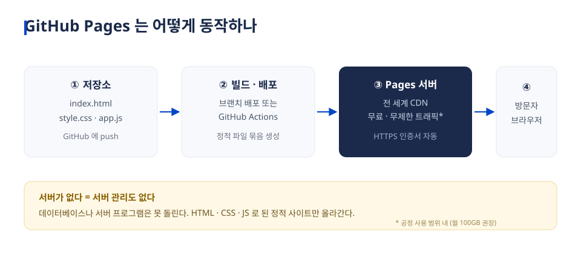

저장소에 올린 **정적 파일**(HTML·CSS·JS)을 그대로 웹사이트로 서비스해 주는 무료 호스팅입니다.
서버가 없으니 서버 관리도 없지만, 데이터베이스나 서버 프로그램은 돌릴 수 없습니다.

| 종류 | 저장소 이름 | 기본 주소 | 사이트 위치 |
|---|---|---|---|
| 사용자 사이트 | `사용자이름.github.io` | `https://사용자이름.github.io/` | 뿌리 `/` |
| **프로젝트 사이트** | 아무 이름 (예: `lms`) | `https://사용자이름.github.io/lms/` | 하위 경로 `/lms/` |

### 1.2 왜 개인 도메인인가

1. **기억하기 쉽다** — `jungaistar.github.io/lms/` 보다 `lms.miraejob.co.kr` 이 짧다
2. **신뢰를 준다** — 학생·고객에게 안내할 주소가 기관 도메인이면 설명이 필요 없다
3. **주소를 잃지 않는다** — 호스팅을 옮겨도 도메인은 그대로 쓴다
4. **규칙을 만들 수 있다** — `lms` · `blog` · `docs` 처럼 저장소마다 하나씩

### 1.3 용어 다섯 개

| 용어 | 뜻 | 비유 |
|---|---|---|
| **DNS** | 도메인 이름을 IP 주소로 바꿔 주는 전화번호부 | 114 안내 |
| **A 레코드** | 이름 → IPv4 주소 (`185.199.108.153`) | 이름 → 집 주소 |
| **AAAA 레코드** | 이름 → IPv6 주소 | 이름 → 새 형식 주소 |
| **CNAME 레코드** | 이름 → **다른 이름** (별명) | "그 사람 연락처는 옆집과 같아요" |
| **TTL · 전파** | 바꾼 값이 퍼지는 데 걸리는 시간 | 새 번호가 전국 안내에 반영되는 시간 |

---

## 2. 준비 — GitHub 저장소 쪽 (STEP 1 ~ 4)

### STEP 1 — 저장소 설정으로 들어간다

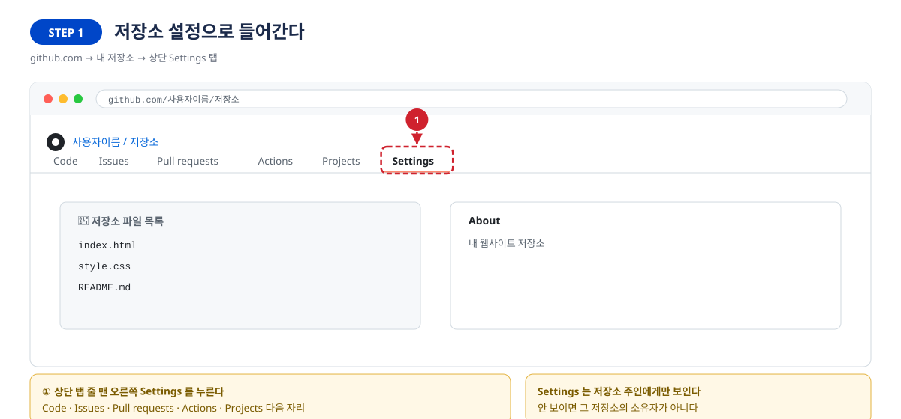

| 구분 | 내용 |
|---|---|
| **어디서** | `github.com` → 내 저장소 |
| **할 일** | ① 상단 탭 줄 맨 오른쪽 **Settings** 를 누른다 |
| **확인** | 주소가 `.../저장소/settings` 로 바뀐다 |

> Settings 탭이 안 보이면 그 저장소의 **소유자가 아닙니다.** 내 계정의 저장소인지 확인하세요.

### STEP 2 — 왼쪽 메뉴에서 Pages 를 찾는다

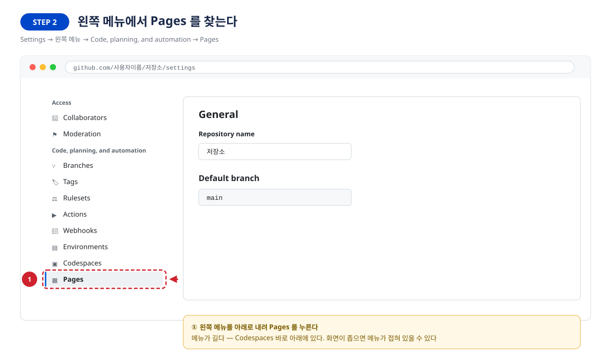

| 구분 | 내용 |
|---|---|
| **어디서** | Settings 화면 왼쪽 세로 메뉴 |
| **할 일** | ① `Code, planning, and automation` 묶음의 **Pages** 를 누른다 |
| **확인** | 오른쪽에 `GitHub Pages` 제목이 나온다 |

> 메뉴가 깁니다. `Codespaces` 바로 아래에 있습니다. 화면이 좁으면 메뉴가 접혀 있을 수 있습니다.

### STEP 3 — 배포 방식(Source)을 고른다

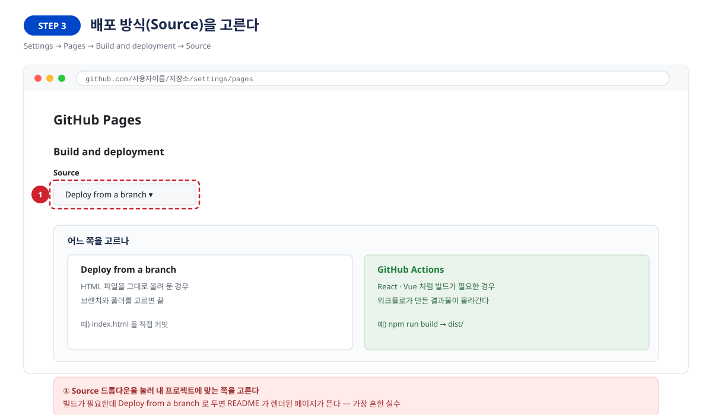

| 구분 | 내용 |
|---|---|
| **어디서** | Pages → `Build and deployment` → `Source` |
| **할 일** | ① 드롭다운을 눌러 내 프로젝트에 맞는 쪽을 고른다 |
| **확인** | 고른 방식이 드롭다운에 표시된다 |

| 고르는 기준 | 언제 | 배포되는 것 |
|---|---|---|
| `Deploy from a branch` | HTML 을 그대로 올려 둔 경우 | 고른 브랜치의 폴더 그대로 |
| `GitHub Actions` | React·Vue 처럼 **빌드가 필요한** 경우 | 워크플로가 만든 결과물 (`dist/` 등) |

> **가장 흔한 실수** — 빌드가 필요한 프로젝트인데 `Deploy from a branch` 로 두면
> 저장소 루트가 그대로 서비스되어 **README 가 렌더된 페이지**가 뜹니다.

### STEP 3+ — (빌드형만) 배포가 성공했는지 본다

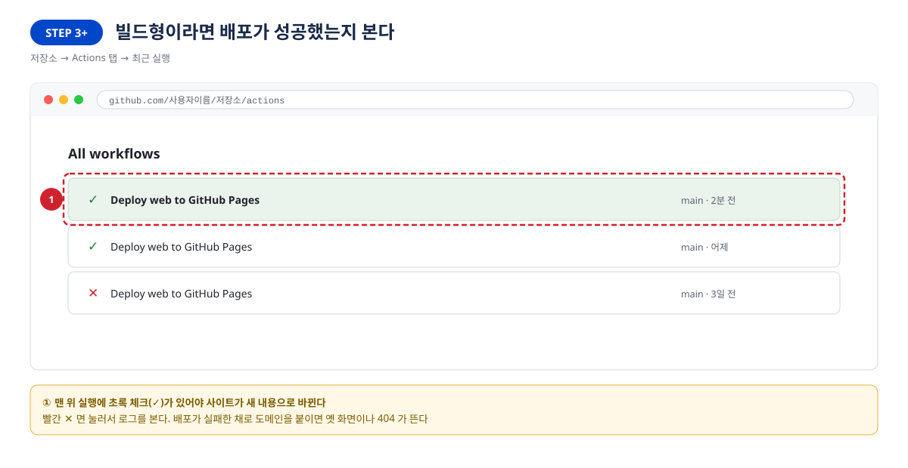

| 구분 | 내용 |
|---|---|
| **어디서** | 저장소 상단 **Actions** 탭 |
| **할 일** | ① 맨 위 실행에 **초록 체크(✓)** 가 있는지 본다 |
| **확인** | 빨간 ✕ 면 눌러서 로그를 본다 |

> 배포가 실패한 채로 도메인을 붙이면 옛 화면이나 404 가 뜹니다. 여기서 걸러야 합니다.

### STEP 4 — 기본 주소부터 확인한다

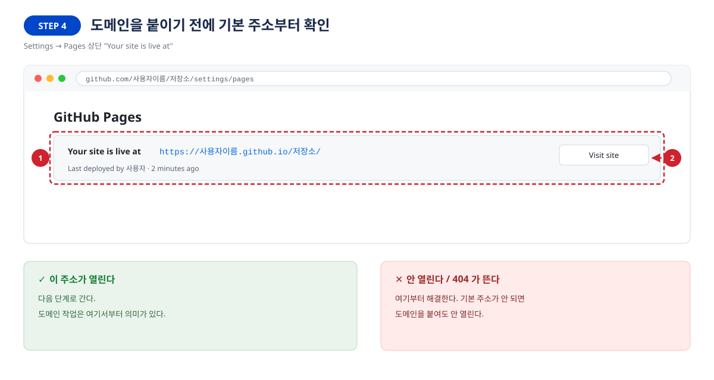

| 구분 | 내용 |
|---|---|
| **어디서** | Settings → Pages 맨 위 `Your site is live at` |
| **할 일** | ① 주소를 확인한다 ② **Visit site** 로 실제로 열어 본다 |
| **확인** | 내 사이트 화면이 뜬다 |

> **여기가 안 되면 도메인을 붙여도 안 됩니다.** 404 가 뜨면 STEP 3 · STEP 3+ 로 돌아갑니다.

---

## 3. DNS — 도메인 관리 사이트 쪽 (STEP 5 ~ 9)

### 먼저: 어떤 레코드를 넣나


| 쓰려는 주소 | 넣을 레코드 | 개수 |
|---|---|---|
| `lms.내도메인.kr` (서브도메인, **권장**) | CNAME → `사용자이름.github.io` | 1개 |
| `내도메인.kr` (루트 도메인) | A → `185.199.108~111.153` | 4개 (+AAAA 4개) |

### STEP 5 — DNS 관리 화면을 연다

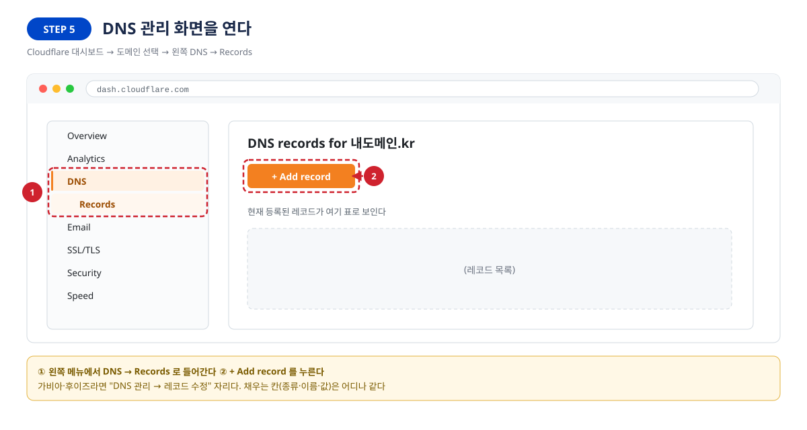

| 구분 | 내용 |
|---|---|
| **어디서** | `dash.cloudflare.com` → 도메인 선택 |
| **할 일** | ① 왼쪽 메뉴 **DNS → Records** ② **+ Add record** 를 누른다 |
| **확인** | 레코드 입력 칸이 펼쳐진다 |

> 가비아·후이즈라면 `DNS 관리 → 레코드 수정` 자리입니다. 채우는 칸(종류·이름·값)은 어디나 같습니다.

### STEP 6 — 레코드 한 줄을 채운다 (서브도메인)

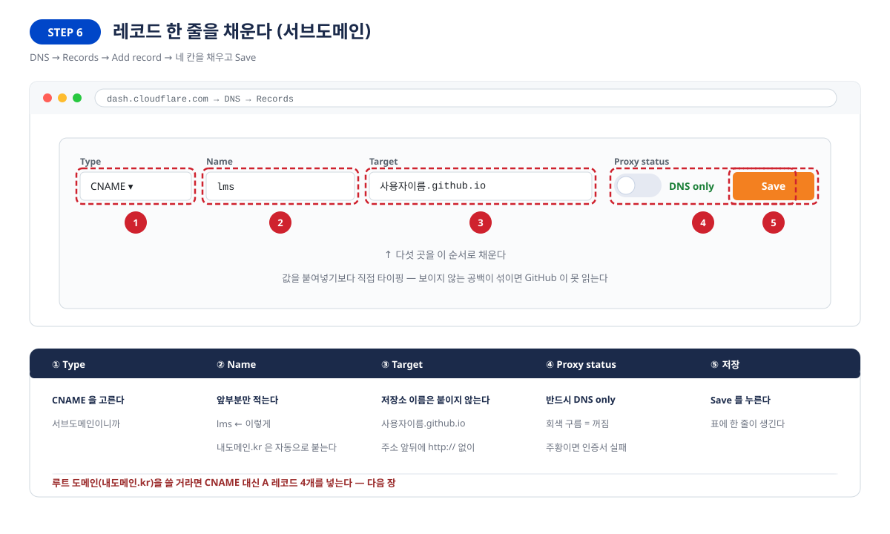

| 번호 | 칸 | 넣는 값 | 주의 |
|---|---|---|---|
| ① | Type | `CNAME` | 서브도메인이니까 |
| ② | Name | `lms` | **앞부분만.** 뒤 도메인은 자동으로 붙는다 |
| ③ | Target | `사용자이름.github.io` | **저장소 이름을 붙이지 않는다.** `http://` 도 없이 |
| ④ | Proxy status | **DNS only (회색 구름)** | 주황이면 인증서가 발급되지 않는다 |
| ⑤ | — | **Save** | 표에 한 줄이 생긴다 |

> 값은 붙여넣기보다 **직접 타이핑**하세요. 보이지 않는 공백이 섞이면 GitHub 이 못 읽습니다.

### STEP 7 — 저장된 레코드를 눈으로 확인한다

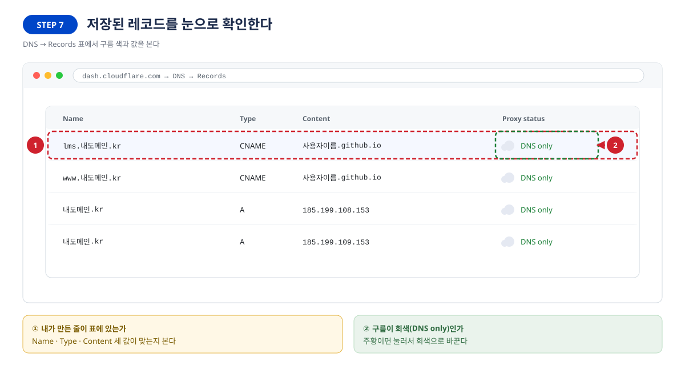

| 구분 | 내용 |
|---|---|
| **어디서** | DNS → Records 표 |
| **할 일** | ① 내가 만든 줄이 있는지 ② 구름이 **회색(DNS only)** 인지 본다 |
| **확인** | Name · Type · Content 세 값이 맞다 |

### STEP 8 — (루트 도메인만) A 레코드 4줄

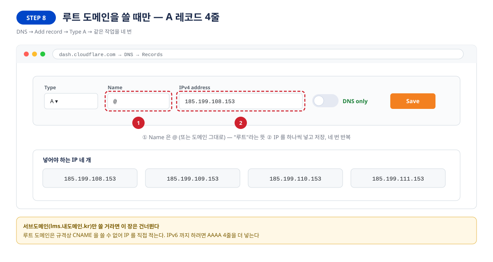

| 구분 | 내용 |
|---|---|
| **어디서** | 같은 Add record 화면 |
| **할 일** | ① Name 을 `@` 로 ② IP 를 하나씩 넣고 저장 — **네 번 반복** |
| **확인** | 표에 A 레코드 4줄이 생긴다 |

```
185.199.108.153    185.199.110.153
185.199.109.153    185.199.111.153
```

> 서브도메인만 쓸 거라면 이 단계는 건너뜁니다.

### STEP 9 — 퍼졌는지 내 컴퓨터에서 확인한다

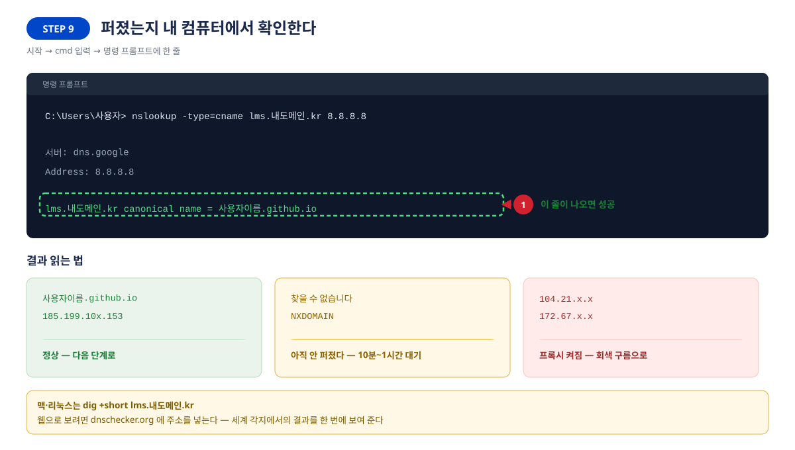

| 구분 | 내용 |
|---|---|
| **어디서** | 시작 → `cmd` → 명령 프롬프트 |
| **할 일** | ① 아래 한 줄을 치고 결과를 읽는다 |
| **확인** | `canonical name = 사용자이름.github.io` 가 나오면 성공 |

```
nslookup -type=cname lms.내도메인.kr 8.8.8.8      ← Windows
dig +short lms.내도메인.kr                        ← macOS · Linux
```

| 결과 | 의미 | 할 일 |
|---|---|---|
| `사용자이름.github.io` · `185.199.10x.153` | 정상 | STEP 10 으로 |
| `찾을 수 없습니다` · `NXDOMAIN` | 아직 안 퍼졌다 | 10분~1시간 기다린다 |
| `104.21.x.x` · `172.67.x.x` | 프록시가 켜져 있다 | STEP 7 로 돌아가 회색 구름으로 |

---

## 4. 등록과 HTTPS (STEP 10 · 13)

### STEP 10 — GitHub 에 도메인을 등록한다

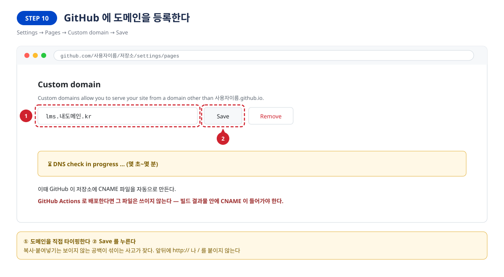

| 구분 | 내용 |
|---|---|
| **어디서** | Settings → Pages → `Custom domain` |
| **할 일** | ① 주소를 직접 타이핑 ② **Save** |
| **확인** | 잠시 뒤 `DNS check successful` 초록 문구 |

> 이때 GitHub 이 저장소에 `CNAME` 파일을 자동으로 만듭니다.
> **GitHub Actions 로 배포한다면 그 파일은 쓰이지 않습니다** — 빌드 결과물 안에 `CNAME` 이
> 들어가야 합니다 (Vite 는 `public/CNAME`).

초록불이 떴다면 **STEP 13** 으로 건너뜁니다. 빨간불이면 STEP 11 로 갑니다.

### STEP 13 — 초록불 확인 → HTTPS 를 켠다

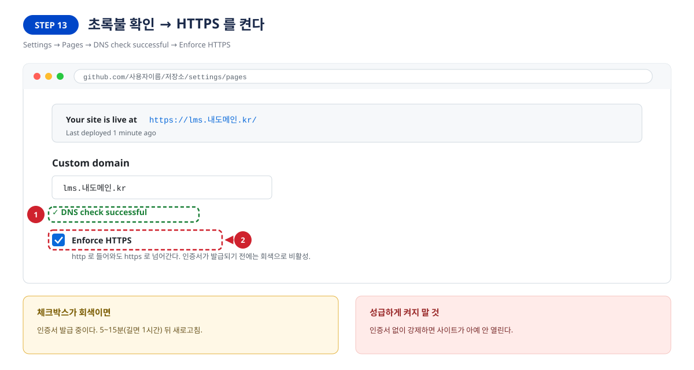

| 구분 | 내용 |
|---|---|
| **어디서** | Settings → Pages 아래쪽 |
| **할 일** | ① `DNS check successful` 확인 ② **Enforce HTTPS** 체크 |
| **확인** | 체크박스가 파랗게 켜진다 |

> 체크박스가 회색이면 인증서 발급 중입니다. 5~15분(길면 1시간) 뒤 새로고침하세요.
> **인증서 없이 강제하면 사이트가 아예 안 열립니다.**

---

## 5. 오류와 해결 (STEP 11 · 12)


### STEP 11 — 빨간 글씨가 떴다면

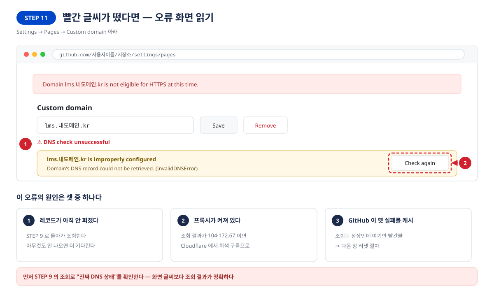

`DNS check unsuccessful` · `Domain's DNS record could not be retrieved (InvalidDNSError)`

| # | 원인 | 확인 방법 | 해결 |
|---|---|---|---|
| 1 | 레코드가 아직 안 퍼졌다 | STEP 9 조회에 아무것도 안 나옴 | 10분~1시간 기다린 뒤 **Check again** |
| 2 | 프록시가 켜져 있다 | 조회 결과가 `104`·`172.67` | STEP 7 에서 회색 구름으로 |
| 3 | GitHub 이 옛 실패를 캐시 | 조회는 정상인데 여기만 빨간불 | **STEP 12 리셋 절차** |

> 화면 글씨보다 **STEP 9 의 조회 결과**가 정확합니다. 원인부터 가르고 손을 대세요.

### STEP 12 — 등록을 리셋한다

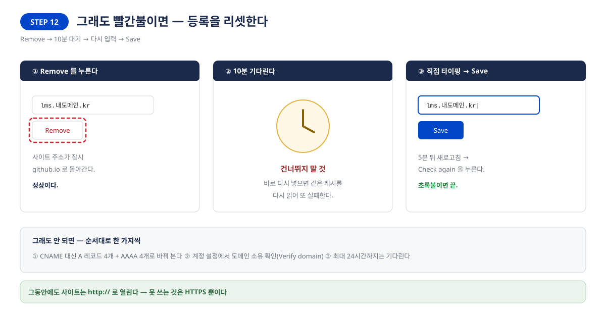

| 순서 | 할 일 | 왜 |
|---|---|---|
| ① | **Remove** 를 누른다 | 등록을 지운다. 사이트는 github.io 주소로 잠시 돌아간다 |
| ② | **10분 기다린다** | 건너뛰면 같은 캐시를 다시 읽어 또 실패한다 |
| ③ | 도메인을 다시 타이핑 → **Save** | 5분 뒤 새로고침 → **Check again** |

그래도 안 되면 순서대로 한 가지씩:

1. CNAME 대신 **A 레코드 4개 + AAAA 4개** 로 바꿔 본다 (STEP 8 방식)
2. 계정 설정 `github.com/settings/pages` 에서 **도메인 소유 확인(Verify domain)**
3. GitHub 의 검사 캐시는 최대 **24시간**까지 남는다 — 기다린다

> 그동안에도 사이트는 `http://` 로 열립니다. 못 쓰는 것은 HTTPS 뿐입니다.

### 그 밖에 자주 만나는 것

| 증상 | 원인 | 해결 |
|---|---|---|
| **404 Page not found** | 배포 실패 · Pages 소스가 틀림 | STEP 3 · STEP 3+ 로 |
| **화면이 하얗다 / CSS 깨짐** | 자산 경로가 `/저장소/` 로 박힘 | 아래 "자산 경로" 참고 |
| 리다이렉트 무한 반복 | Cloudflare SSL 모드가 `Flexible` | `Full (strict)` 로 변경 |
| 메일이 스팸으로 간다 | `_dmarc`·`_domainkey` 에 프록시가 켜짐 | 회색 구름으로 변경 |
| 배포는 됐는데 옛 화면 | 브라우저 캐시 | `Ctrl+Shift+R` |

### 빌드형 프로젝트의 자산 경로

| 설정 | github.io/저장소/ | 내도메인/ |
|---|---|---|
| `base: '/저장소이름/'` | ✅ | ❌ 화면이 하얗게 뜬다 |
| `base: '/'` | ❌ | ✅ |
| **`base: './'` (상대 경로)** | ✅ | ✅ |

```js
// vite.config.ts
export default defineConfig({
  base: './',        // 양쪽 주소에서 모두 동작 — 전환 중에도 사이트가 죽지 않는다
});
```

---

## 6. 마무리 (STEP 14)

### STEP 14 — 브라우저에서 최종 확인

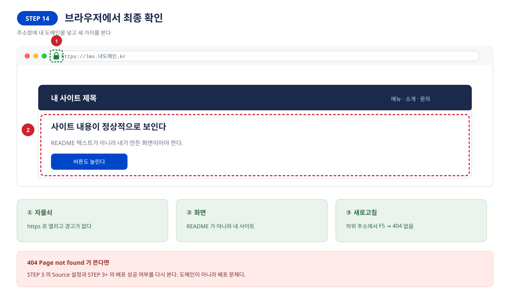

| 확인 | 무엇을 보나 |
|---|---|
| ① 자물쇠 | `https://` 로 열리고 경고가 없다 |
| ② 화면 | README 가 아니라 **내 사이트** |
| ③ 새로고침 | 하위 주소에서 `F5` → 404 가 안 난다 |

- [ ] `https://내도메인` 이 열린다
- [ ] 자물쇠가 보인다
- [ ] 휴대폰에서도 열린다
- [ ] 옛 주소(`github.io/저장소/`)로 들어가면 새 주소로 넘어간다

---

## 7. 실전 사례 — `lms.miraejob.co.kr`

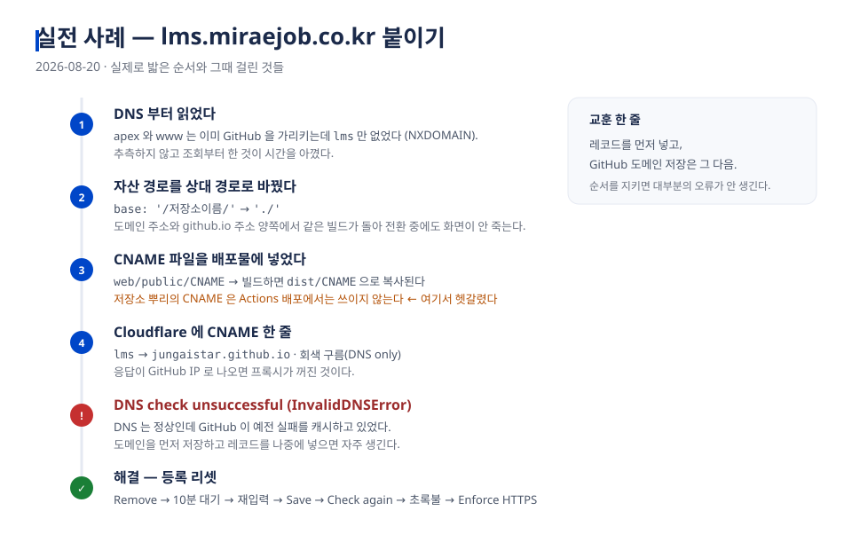

이 교안의 화면과 오류는 아래 실제 작업에서 나왔습니다.

| 항목 | 값 |
|---|---|
| 저장소 | `jungaistar/lms` (React + Vite, GitHub Actions 배포) |
| 기존 주소 | `https://jungaistar.github.io/lms/` |
| 목표 주소 | `https://lms.miraejob.co.kr` |
| DNS | Cloudflare |

### 밟은 순서와 걸린 것

| 단계 | 무슨 일 | 교안의 어디 |
|---|---|---|
| DNS 부터 조회 | apex·www 는 이미 GitHub, `lms` 만 없었다(NXDOMAIN) | STEP 9 |
| 자산 경로 수정 | `base: '/lms/'` → `'./'` | 5장 자산 경로 |
| CNAME 파일 위치 | 저장소 뿌리가 아니라 `web/public/CNAME` | STEP 10 주의 |
| Pages Source | `Deploy from a branch` 로 바뀌어 있었다 | STEP 3 |
| Cloudflare 레코드 | `lms` → `jungaistar.github.io` · 회색 구름 | STEP 6 |
| **DNS check 실패** | 도메인을 먼저 저장하고 레코드를 나중에 넣었다 | STEP 11 · 12 |
| 곁다리 발견 | `_dmarc`·`_domainkey` 프록시로 메일 인증 깨짐 | 5장 표 |

### 여기서 뽑은 규칙 다섯

1. **레코드 먼저, GitHub 도메인 저장은 나중** — 순서만 지켜도 STEP 11 이 안 생긴다
2. **문서보다 조회를 믿는다** — `nslookup` 한 줄이 추측 30분을 아낀다
3. **빌드형은 상대 경로** — 전환 중에도 양쪽이 살아 있다
4. **CNAME 파일은 배포물 안에** — 저장소 뿌리가 아니다 (Actions 배포일 때)
5. **회색 구름** — Cloudflare 를 쓰면 이것 하나로 절반이 갈린다

---

## 8. 강의 운영 가이드

### 90분 타임테이블

| 시간 | 내용 | 화면 |
|---|---|---|
| 0~10분 | 도입 — 결과물 시연, 전체 지도 | `concept-02` |
| 10~20분 | 개념 — Pages·DNS·레코드 | `concept-01`, `concept-03` |
| 20~35분 | **실습 ①** STEP 1~4 (저장소 확인) | `step-01`~`step-04` |
| 35~55분 | **실습 ②** STEP 5~9 (DNS 넣고 조회) | `step-05`~`step-09` |
| 55~65분 | **실습 ③** STEP 10 (도메인 등록) | `step-10` |
| 65~75분 | 대기 시간 — 오류 화면 설명 | `step-11`, `step-12` |
| 75~85분 | **실습 ④** STEP 13~14 (HTTPS·확인) | `step-13`, `step-14` |
| 85~90분 | 정리 — 규칙 다섯 · 과제 | `concept-05` |

> **대기 시간을 미리 설계하세요.** DNS 전파와 인증서 발급은 강사가 못 줄입니다.
> 실습 ② 를 일찍 시켜 놓고 그동안 이론을 하면 흐름이 끊기지 않습니다.

### 실습 과제

**기본** — 자기 도메인의 서브도메인 하나를 골라 연결하고, `https://` 로 열리는 화면을 캡처해 제출

**심화** — ① 저장소 두 개를 서로 다른 서브도메인에 붙이기 ② 루트 도메인(A 레코드)으로 연결해 비교하기
③ 일부러 프록시를 켜서 증상을 관찰하고 복구하기

### 평가 체크리스트

| 항목 | 배점 |
|---|---|
| 도메인으로 사이트가 열린다 | 30 |
| HTTPS 자물쇠가 보인다 | 20 |
| 레코드를 올바른 종류로 넣었다 (루트=A, 서브=CNAME) | 20 |
| 오류를 만났을 때 원인을 문장으로 설명할 수 있다 | 20 |
| 조회 명령으로 스스로 확인했다 | 10 |

### 강사가 미리 알아 둘 질문

| 질문 | 답 |
|---|---|
| "도메인 없이 실습할 수 있나요?" | 안 됩니다. 강사 도메인의 서브도메인을 나눠 주세요 |
| "www 도 되게 하려면?" | `www` CNAME 을 추가하고, GitHub 은 한 도메인만 등록 |
| "회사 도메인이라 DNS 를 못 만져요" | STEP 6 표를 그대로 전산 담당자에게 전달 |
| "얼마나 기다려야 하나요?" | 보통 10분 내. 24시간까지는 정상 범위 |
| "돈이 드나요?" | 도메인 값만. Pages 와 인증서는 무료 |

---

## 부록 A. 한 장 요약

```
STEP 1~2   저장소 → Settings → Pages
STEP 3     Source 고르기 (빌드형이면 GitHub Actions)
STEP 3+    Actions 탭에서 초록 체크 확인
STEP 4     github.io 기본 주소로 사이트가 열리는지 확인
STEP 5~7   DNS 관리 → Add record → CNAME · lms · 사용자이름.github.io · 회색 구름
STEP 8     (루트 도메인이면) A 레코드 4개
STEP 9     nslookup 으로 퍼졌는지 확인
STEP 10    GitHub → Pages → Custom domain 입력 → Save
STEP 11~12 빨간불이면 원인 3가지 확인 → Remove·10분·재입력
STEP 13    초록불 뒤 Enforce HTTPS 체크
STEP 14    브라우저에서 자물쇠·화면·새로고침 확인
```

## 부록 B. 명령어 모음

```bash
nslookup -type=cname lms.내도메인.kr 8.8.8.8   # 서브도메인 (Windows)
nslookup 내도메인.kr 8.8.8.8                    # 루트 도메인 (Windows)
dig +short lms.내도메인.kr                      # macOS · Linux
curl -sSI https://lms.내도메인.kr | head -5     # 응답 헤더 확인
```

## 부록 C. GitHub Pages 주소 (2026년 기준)

| 종류 | 값 |
|---|---|
| A (IPv4) | `185.199.108.153` · `185.199.109.153` · `185.199.110.153` · `185.199.111.153` |
| AAAA (IPv6) | `2606:50c0:8000::153` · `8001::153` · `8002::153` · `8003::153` |

> 서브도메인에 CNAME 을 쓰면 이 표를 신경 쓸 필요가 없습니다.

## 부록 D. 화면 파일 목록

| 파일 | 장면 |
|---|---|
| `step-01` ~ `step-04` | 저장소 Settings · Pages · Source · 기본 주소 확인 |
| `step-03b` | Actions 배포 성공 확인 |
| `step-05` ~ `step-09` | DNS 화면 · 레코드 입력 · 저장 확인 · A 레코드 · 조회 |
| `step-10` | Custom domain 등록 |
| `step-11` ~ `step-12` | 오류 화면 · 리셋 절차 |
| `step-13` ~ `step-14` | HTTPS · 브라우저 최종 확인 |
| `concept-01` ~ `concept-05` | 개념도 · 흐름 · 레코드 종류 · 진단 · 실전 사례 |

---

*이 교안은 실제 구축 사례(2026-08-20, `lms.miraejob.co.kr`)를 바탕으로 작성되었습니다.*
