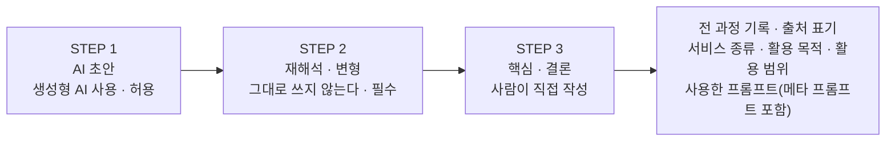

<!-- 이 파일은 슬라이드 1장 = `---` 로 나뉜 한 덩어리다.
     Marp / Slidev / reveal-md 어디에 넣어도 같은 장 수로 떨어진다.
     같은 내용의 완성 슬라이드는 week01.html 에 있다. -->

<!-- _class: cover -->

# 제1강  오리엔테이션

**창업과 기업가 정신**

창의융합교양학부 · 정동엽 교수

---

## 여러분과 함께 하는 저는?

### 정 동 엽 &nbsp;<small>창의융합교양학부 · dimajob4u@gmail.com</small>

- 아시아퓨처스그룹 사무국장
- 아시아미래인재연구소 (前)교육실장 및 전문연구원
- 경기대학교 일반대학원 직업학과 박사수료
- 가천대학교 경영대학원 고용 및 직업상담학과 석사
- 한국기술교육대학교 능력개발원 **4차 산업혁명과 일/직업의 변화** 교수
- **서울산업진흥원 신직업전문컨설턴트 및 자문위원, 창업 닥터(2013~2020년)**
- 고용노동부 직업심리 전문가(성인, 청소년, 대학생)
- 고용노동부 온라인직업심리 전문가**(청소년)**
- 미래학기반 커리어 컨설턴트
- IT업계 20년 근무(교학사, 삼보컴퓨터 등에서 교육정보화 관련 컨설팅 업무 진행)
- **한국어교원 2급(문화체육관광부)**
- **고용노동부 직업훈련교사 3급(마케팅, 정보기술전략·계획)**
- 모금전문가, 평생교육사, 사회복지사
- 국제공인NLP Practitioner

---

## 목차 | CONTENTS

1. 강의 개요(강의계획서)
2. 성적 평가
3. 주 별 강의 계획
4. 강의요구분석(설문)
5. 창업 인식도 조사(설문)

---

<!-- _class: chapter -->

# CHAPTER 1 · 강의 개요(강의계획서)

교과 목표 및 교재 등에 대한 소개

---

## 교과 목표

**『창업과 기업가 정신』 한 학기 수업을 마치면…**

| | |
|---|---|
| 🧩 | 하나의 지식을 얻으면 **응용하여 시도해 보지 않은 방식**에 적용할 수 있다. |
| 🔭 | 주어진 상황을 여러 관점으로 바라보고 **새롭고 독창적인 아이디어**를 찾을 수 있다. |
| 🛠️ | 다양한 지식, 기술, 정보를 활용하여 **자신만의 새로운 방식**을 찾을 수 있다. |
| 🔗 | 서로 다른 분야의 지식 및 정보들을 연결하여 **새로운 가치를 창출**할 수 있다. |

---

## 주 교재 | 창업과 기업가 정신(자체 교재)

- **『창업과 기업가 정신』** — 자체 제작 교재
- 한 학기 강의 전 주차가 이 교재의 차례를 따라간다.
- 배포 방법과 일정은 **LMS 공지**로 안내한다.

---

## 부 교재 | 밸류 프로포지션 디자인

| 항목 | 내용 |
|---|---|
| 도서명 | 밸류 프로포지션 디자인 |
| 저자 | 알렉스 오스터왈더 외 |
| 출판 | 아르고나인미디어 그룹 |

---

<!-- _class: chapter -->

# CHAPTER 2 · 성적 평가

출석, 중간고사, 기말고사, 과제물 등 성적 평가 방법 소개

---

## 성적평가 — 평가 기준에 따라 적용합니다.

### 1. 성적평가

| 출석 | 중간시험<br>개인별 발표 | 기말시험<br>(실기) | 과제물제출 및 참여도(수업태도) |
|:---:|:---:|:---:|:---:|
| 20% | 30% | 30% | 20% |

- **중간고사 : 개인별 과제 및 발표**
- **기말고사 : write-up**
  - 아이디어의 독창성 : **15점**
  - 비지니스의 성공가능성 : **15점**

📍 **취·창업 및 진로상담** 참여는 과제물·수업태도 영역에 가산한다.

---

## 성적평가 — 출석 · 공결 기준

📱 **출석 :** 1. 전자출결(헤이영) — 유연한 출결 관리 불가

**2. 공결 기준** <small>(* 자세한 내용은 학교 홈페이지 참조)</small>

- 국가에서 부과한 의무를 이행한 경우 (예: 병무 관련 신체검사, 예비군 훈련)
- 총장이 인정한 국제 또는 국내 행사나 각종 대회에 참가한 경우
- 정부기관의 요청에 의한 특별회합 참가의 경우
- 경조사의 경우
- 본인 질병(입원) 및 감염병의 예방 및 관리에 관한 법률에 따라 격리 수용이 필요한 경우
- 단순질병 (**1회만 인정 가능**)

> 💼 취업 관련 면접(**면접확인서 필수**)은 인정함.
> ⚠️ **¼ 결석자 학점 미취득(F, 1주차 포함)** / 진단서 **1주 이내 제출**만 유효

---

<!-- _class: chapter -->

# CHAPTER 3 · 주차 별 강의 계획

주차 별 강의 계획을 통해 한 학기 교수-학습의 흐름 파악

---

## 주차 별 강의 계획 — 강의계획서에 따라 진행합니다.

| 주 | 주차 별 강의 주제 | 과제물 |
|:--:|---|---|
| 1 | 오리엔테이션 | 강좌요구분석, 창업교육영향조사 |
| 2 | 창업과 기업가 정신 (기업가정신의 개념, 기업가 정신의 구성요소) | |
| 3 | 달라진 일자리 세계 이해 (인공지능 혁명의 시대와 일자리 변화, 미래 직업세계의 이해) | |
| 4 | 새로운 미래 인재의 조건 (미래 인재의 조건, 자기다움의 발견) | 창업적성검사 결과지 제출 |
| 5 | 창업과 창업절차 이해 (창업의 개념, 창업의 유형 및 절차) | |
| 6 | 기업가정신의 경영관리 (창업경영의 성공 요인, 창업기업의 경영 관리) | |
| 7 | 비즈니스 기회를 찾는 법 (창업 기회의 의미, 창업 기회의 원천 발견) | |
| 8 | **중간고사** (과제물 발표 및 피드백) | |
| 9 | 창업아이디어 발굴 (아이디어의 의미, 아이디어 발굴 방법) | |
| 10 | 창업아이템 개발 (창업 아이템 선정, 창업 아이템 개발) | 활동 결과물 제출 |
| 11 | 사업타당성 분석 (사업타당성의 개념, 사업타당성의 분석 방법) | 활동 결과물 제출 |
| 12 | 비즈니스 모델과 린 스타트업 (비즈니스 모델의 개념, 린 스타트업의 이해) | |
| 13 | 사업계획서 작성법 (사업계획서의 개념, 사업계획서 작성 방법) | |
| 14 | 기업가정신의 현재와 미래 (기업가정신의 배경, 기업가정신의 유형) | |
| 15 | **기말고사** | 창업 계획서 제출 및 발표 |

---

## 과제물 제출 안내

📨 과제물은 **‘LMS’ 과제방** 혹은 저의 메일로 해당 주차 **강의일 하루 전 23:59:59**까지 이 메일 주소로
dimajob4u@gmail.com 으로 제출하시면 됩니다.

```
ex)   3.15, 23:59:59  ●───────────────────────▶  3.16, 14:00
      과제물 제출 일시                              본 강의
              ▲───────── 강의일 하루 전까지 ─────────┘
```

---

<!-- _class: chapter -->

# CHAPTER 4 · 강의 요구 분석

강의를 통해 무엇을 얻고자 하는지 설문조사로 알아보기

---

## 이번 강의를 통해 무엇을 얻고 싶은가요?

- 🧭 나의 진로 및 취업/창업 준비 정도는?
- ❓ ‘창업과 기업가정신’ 교과목을 수강하게 된 이유는? <small>(중복응답 가능)</small>
- 📚 ‘창업과 기업가정신’ 교과목을 통해 배웠으면 하는 내용은 무엇인가요?
- 💬 ‘창업과 기업가정신’ 교과목 담당 교수에게 바라는 점이 있다면?

### 설문 방법 안내

✅ 구글 설문지 링크 주소는 **‘LMS의 과제방’**에 게시함

강의 요구 분석 구글 설문지 주소 — https://forms.gle/MFzxxUcyqWbqU7tr6

---

<!-- _class: chapter -->

# CHAPTER 5 · 창업 인식도 조사

창업에 대한 학습자들의 인식 정도를 파악하여 수업에 반영

---

## 창업교육 정책에 반영하고자 합니다.

**대학생 창업교육이 창업가 정신 및 진로준비행동에 미치는 영향에 대한 조사** &nbsp;`ID`

<small>* 본 설문은 통계법 33조(비밀의 보호)에 따라 개인정보는 통계목적으로만 사용·보호됩니다.</small>

안녕하십니까? 귀하의 행복과 발전을 기원합니다.

4차 산업혁명시대의 도래와 함께 방송·예술분야에 대한 사회적 관심이 날로 확대되고 있습니다.
특히 4차 산업혁명은 방송(미디어)기술과 예술콘텐츠의 결합을 통한 신산업 창출을 가속화 할 것으로 예상됩니다.

이에 본교에서는 학생들의 취업 및 창업역량강화를 위해 LINC+ 사업의 일환으로 다양한
창업교육지원사업(방송예술 창업가 양성특강, 방송예술 창업가 양성 캠프, 지적재산권반 운영,
1인 예술가 양성 강좌 운영 등)과 창업보육지원사업(문화콘텐츠창업가육성, 창업교육센터 구축,
창업경진대회 등), 창업사업화지원사업(창업가 양성 정부사업 참여지원, 1인 예술가 벤치마킹지원,
창업교육센터활성화 등), 취업교육 및 취업지원사업(문화예술인 양성 강좌운영, 1인 예술가 채용오디션 등)을
전개하고 있습니다.

이에 본 설문은 창업 교과목이 창업가 정신 및 진로역량 강화에 미치는 효과를 측정하기 위해
작성되었습니다. 본 연구를 통해 도출된 결과물은 학생들의 창업교육 정책 결정에 의미 있게
활용될 것입니다. 여러분의 소중한 의견 주시면 감사하겠습니다.

<div align="right">연구책임자 : 동아방송예술대학교 김성길 교수 (careerdima@gmail.com)</div>

---

## 창업 인식도 조사 — 설문 방법 안내

☑ 구글 설문지 링크 주소는 **‘LMS의 과제방’**에 게시함 <small>(OT 종결 후 업로드)</small>

📝 **Y4반 창업교육 영향 조사 구글 설문지 주소**
https://forms.gle/puGT1NQXUyzc8ASeA

---

## 생성형 AI 사용 지침

📚 **0. 모든 과제 및 발표자료, 팀프로젝트에 적용한다.**

| # | | 지침 |
|:--:|:--:|---|
| 1 | 📝 | 초안본 작성에는 **생성형 AI 사용을 허용**한다. |
| 2 | ✍️ | **핵심 아이디어, 최종 분석과 결론**은 반드시 사람이 직접 작성해야 한다. |
| 3 | 🔍 | 생성형 AI 사용 시 **서비스 종류 · 활용 목적 · 활용 범위**를 명시하고 출처를 표기한다.<br>· 사용한 **프롬프트를 반드시 제시**해야 한다 (메타 프롬프트 포함). |
| 4 | 🔄 | AI 답변을 그대로 쓰지 않고 **재해석 · 변형하여 발전**시킨다. |
| 5 | ⚠️ | 지침 위반 시 **모든 불이익은 작성자인 담당자**에게 있음을 고지한다. |



### 📋 출처 표기 양식 <small>(과제 끝에 붙여 제출)</small>

```
[생성형 AI 활용 표기]
· 사용 서비스   : [서비스명 / 모델명]
· 활용 목적     : [자료 조사 · 초안 작성 · 문장 다듬기 …]
· 활용 범위     : [예: 2장 초안, 전체의 약 20%]
· 사용 프롬프트 : [입력한 프롬프트 전문 · 메타 프롬프트 포함]
```

---

<!-- _class: chapter -->

# 다음 차시 안내 · 2차시

**제1강 창업과 기업가 정신** (기업가정신의 개념, 기업가 정신의 구성요소)

> 미래의 세대는 창업으로 기업가 정신이 필요하다.
> 기업가 정신의 개념과 기업가 정신의 구성요소를 확인한다.
